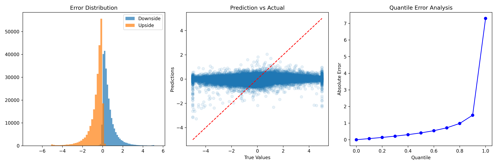
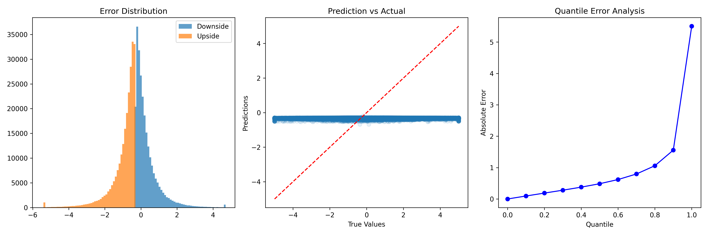
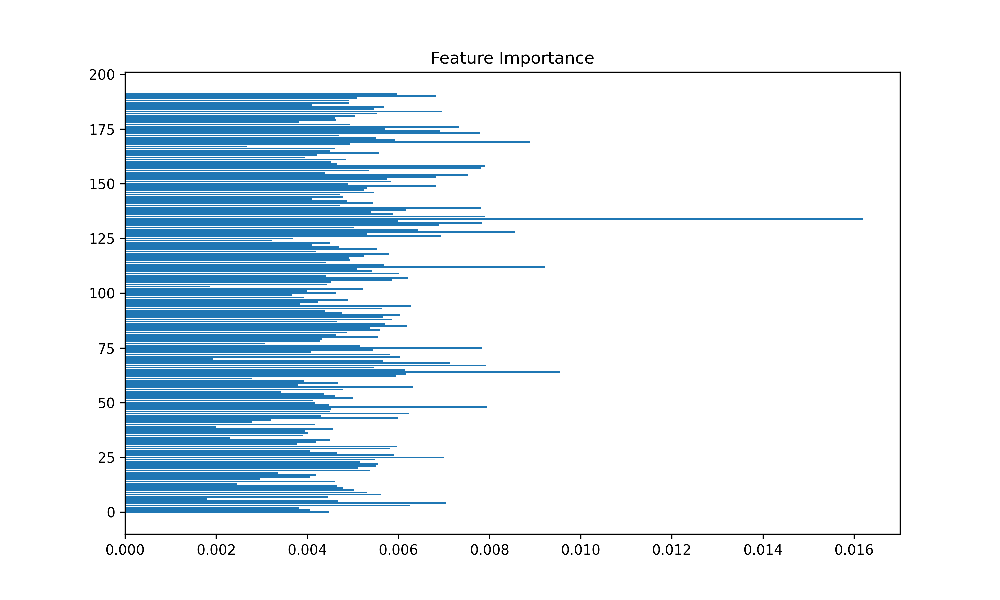
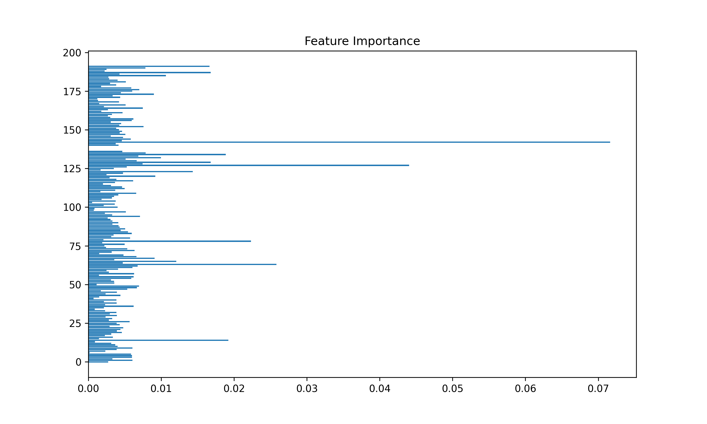

# 基于 XGBoost 的高频交易噪声过滤与多空信号识别

任凯（2024 FinTech，2401212437）

```python
JS-Real-Time-Market-Data-Forecasting/
├── Data/ # Data directory, too big to upload, follow the report to build by yourself.
├── CodeXGBoost/ # Code directory
├── Imgs/ # All images used.
├── Doc/ # Documents.
├── README-XGBoost.md # .md format report.
└── requirements.txt # The dependencies. 
```


## 1. Introduction

本作业以 Kaggle 竞赛 Jane Street 数据为例，在第一次作业的基础上将 CNN 模型调整为 XGBoost 模型进行进一步探索。核心目标是：掌握高频交易数据中使用 XGBoost 进行回归建模的基本流程；构建动态加权机制，引导模型更加关注极端下跌样本，提高下行风险预测能力；完成回归模型的参数搜索、性能评估及可视化分析；分析模型在市场噪声过滤中的表现及其实际应用潜力。

本报告尽可能详细展示了作者解答本作业问题的思路，整体的组织架构直接参照助教给出的报告要求。总的来说，本作业解答核心框架如图 1. 所示，共分为**数据集处理、模型搭建和实验三个部分**。具体来看：数据集处理包括从竞赛官网下载原始数据、按照要求进行数据预处理以及重新组织数据三个关键步骤；模型搭建核心在于构造目标数据集、按要求构建模型以及设定合理的超参数集合；在上述两个部分完成后就可以开始进行实验，在训练和验证中调整模型架构和关键超参，进而得到并分析相关实验结果。


<center>图 1. 作业整体框架</center>

需要进一步说明的是，本作业并没有像标准的深度学习项目那样，在训练和验证结束后在测试集上进行进一步测试，核心原因是赛事主办方没有公开合理的测试集，尽管原是数据下载后有 `test` 的部分数据，但是这些数据的组织形式明显是过于模糊、简单化的。因此将本作业的重心放在对量化研究整体流程的理解上，首先通过将主办方提供的训练数据人工划分为训练和验证部分，然后拉通整体流程，最后对结果进行详细分析，在实现作业要求的同时，深刻地理解了各步骤中的处理细节，加深对数据处理、模型构建以及实验的认知。总而言之，本作业想要突出的核心工作如下：

- 本作业搭建了一套通用时序数据建模框架，XGBoost 及其学习模型完成信号预测与噪音识别。所有代码目前均已[**开源**](https://github.com/KarryRen/Karry-Studies-AI/tree/main/Cases/JS-Real-Time-Market-Data-Forecasting)。
- 数据处理上：基于对空缺值的探索，筛选关键指标并完成空值填充。进一步地使用 z-score 方法进行特征标准化，最终通过跨时间步和调整形状的方式将时序特征数据调整为通道数为滞后期 `time_step` 的时序张量数据。对于预测标签而言，使用竞赛中衡量评分的关键标签 `responder_6`，同时按要求设计了三级加权机制，对普通下跌和极端下跌样本分别赋予不同权重。
- 模型构造上：搭建 XGBoost 模型，并结合 RandomizedSearchCV 实现对模型的参数优化，同时关注各类超参数的组合效果；
- 实验方案设计上：引入标准 RMSE、加权 RMSE 以及上下行误差对比等多项指标，综合衡量模型预测精度与风险识别能力。

本报告后续按如下结构组织：第 2 节描述了数据处理的详细过程；第 3 节说明了模型构造的具体细节；第 4 节则呈现了实验设计思路及结果；最后在第 5 节呈现了结论与延伸思考。


## 2. Dataset

详细梳理、了解并处理数据集是进行建模的第一步。数据清洗和处理思路和 CNN 部分基本相同，不再过多赘述，在此仅呈现重点的不一致操作。首先，因为不需要再进行噪音预测，因此将之前数据处理中的噪音生成操作删除。其次，按照要求我设计了三级加权机制，对普通下跌和极端下跌样本分别赋予不同权重。原始数据已经有评分函数中的权重，此处直接对下跌点进行强化即可。responder_6 的分布情况如图 2. 所示，均值基本为 0，存在明显的厚尾效应。基于该图，我将 responder_6 处于 `[-2, 0)` 的区间视为普通下跌样本，权重做 2.5 倍强化处理；处于 `[-5, -2)` 的区间视为极端下跌样本，权重做 4 倍强化处理。


<center>图 2. responder_6 的分布情况</center>


## 3. Model

数据处理完成后，按照作业要求，使用 XGBRegressor，结合 RandomizedSearchCV 在给定参数空间中进行搜素并得到最终结果。对模型进行 20 次迭代超参数搜索，优化目标为负均方根误差（neg RMSE），并设置早停机制防止过拟合，同时进行两折交叉验证。模型具体原理不在此赘述，详情见参考文献。


## 4. Experiment

本作业所有实验均在一张 RTX4090 上完成。核心对比在训练集上选择下行加权前后的模型表现。具体的性能指标情况如表 1。可以发现加权后下行市场中的预测错误明显减少（降低 54%），显著低于不加权情况（降低 4.61%）。这说明加权处理明显改善了模型在极端下行情况下的预测表现，这种处理方法具有恒强的的市场风险识别潜力。

<center>表 1. 训练集下行加权前后性能指标对比表</center>

| Method           | Standard RMSE | Weighted RMSE | Upside Error | Downside Error | Downside Reduction |
| ---------------- | ------------- | ------------- | ------------ | -------------- | ------------------ |
| 训练集下行未加权 | 0.9630        | 1.6869        | 0.6549       | 0.6247         | 4.61%              |
| 训练集下行加权   | 1.0198        | 1.6094        | 0.9757       | 0.4488         | 54.00%             |

更详细地来看，下行加权前后相关的具体可视化图分别为图 3 和图 4，明显对市场下行点的预测误差要小（误差比较靠近 0）。从预测和实际对比图来看，如果不加权，整体的预测波动较大很容易造成较大误差，而加权后预测值基本都在 0 以下，且整体波动较小，但因为预测能力有限基本看不出和真值存在的线性关系。而结合分位误差来看，可以看到该数据集的预测结果明显存在厚尾误差，在较尾部的部分绝对误差明显偏高，但在 90% 分位以内模型误差分布比较鲁棒。



<center>图 3. 训练集下行未加权后相关表现图</center>



<center>图 4. 训练集下行加权后相关表现图</center>

最后，基于 XGBoost 的算法特性，我仔细查看了特征重要性柱状图。因为滞后 3 期，每一期都有 64 个特征，所以共有 192 个特征。对比加权前后的重要性分布情况，可以发现：无论加权与否，特征值重要性之间存在明显差异。但加权后不同特征之间的重要性差别更大，其中明显有一些特征的重要性较高，而有一些特征的重要性基本为 0。这说明加权后改变了对特征空间的筛选性质，这有助于后续对特征内容的进一步理解，便于简化特征空间，进而实现更精准、轻量级地预测。



<center>图 5. 训练集未下行加权后的特征重要性分布图</center>



<center>图 6. 训练集下行加权后的特征重要性分布图</center>

## 5. Conclusion

本报告详细呈现了作业完成思路，作业代码框架。实验结果充分验证了作业假设：加权机制明显改善了模型在极端下行情况下的预测表现，具有一定的市场风险识别潜力；相较于标准 RMSE，使用加权 RMSE 更能反映模型在实盘交易中对下跌风险的响应；实验过程中发现部分特征对模型贡献显著，后续可在特征筛选与维度压缩上进一步优化。

总之，本次作业完成过程充分延伸了邹老师上课所讲的基础知识，更为深刻、具体地认识到了理论含义，在实际编码过程中对人工智能项目框架也有了更为清晰的理解。尤其是对上课未提及的 XGBoost 等机器学习模型又了更明确的理解。

本报告所用数据、方法、代码目前均已开源。


## References

Chen, T., & Guestrin, C. (2016, August). Xgboost: A scalable tree boosting system. In *Proceedings of the 22nd acm sigkdd international conference on knowledge discovery and data mining* (pp. 785-794).
