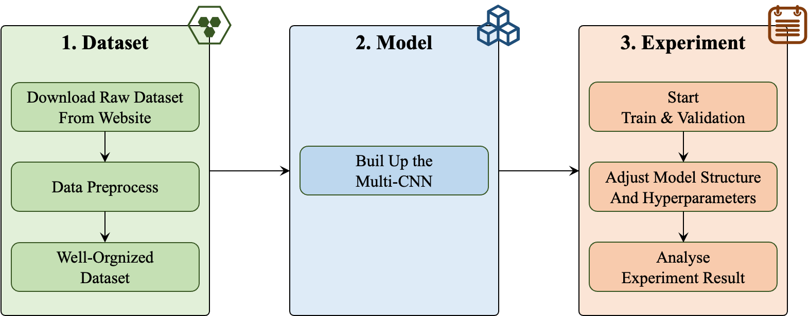
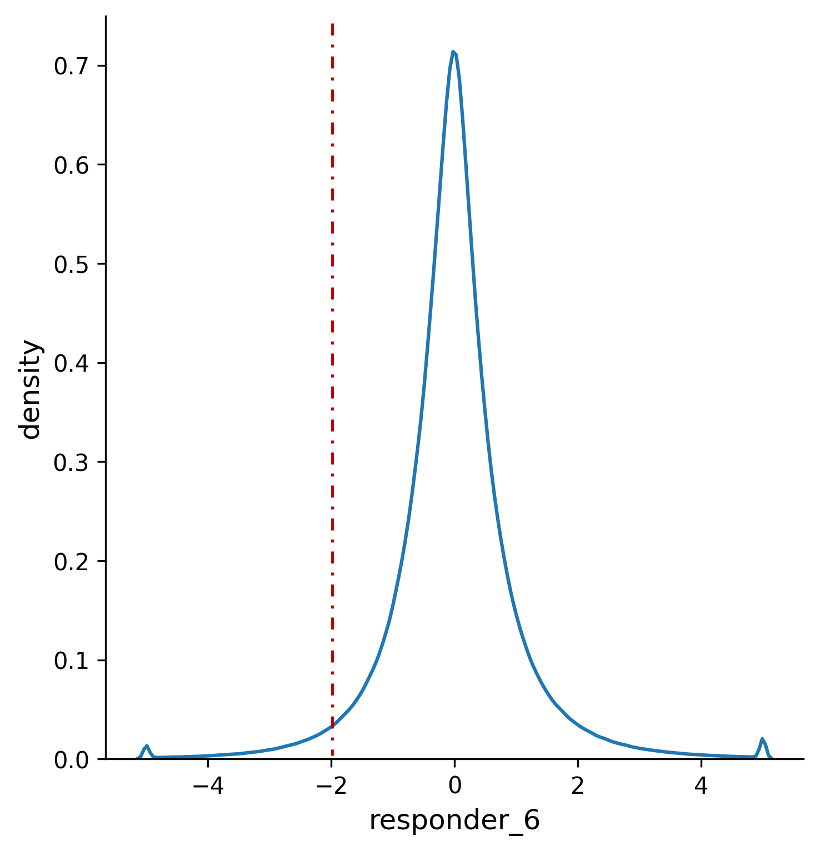
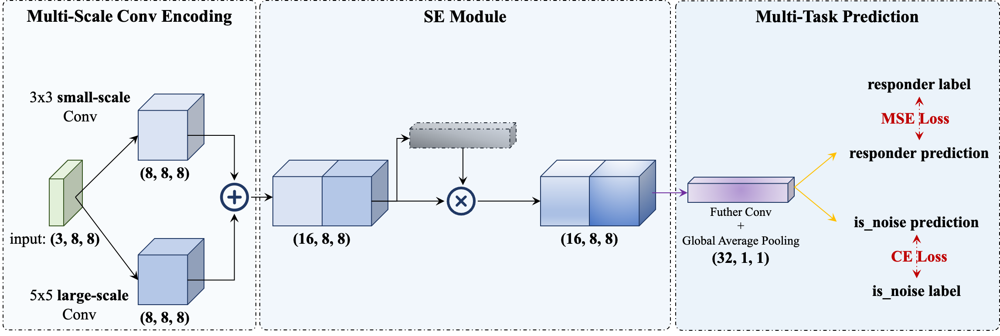
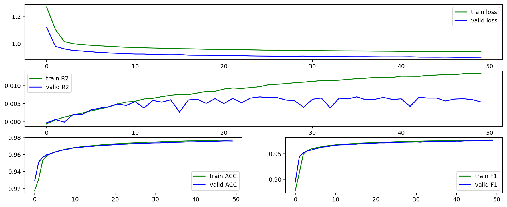
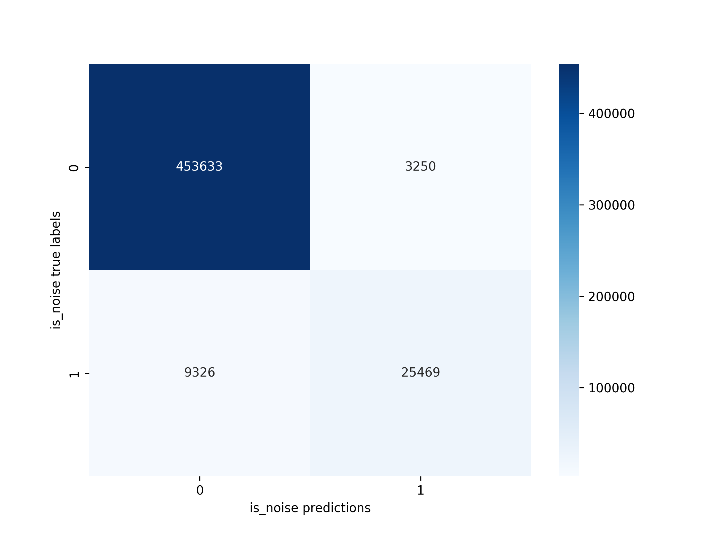
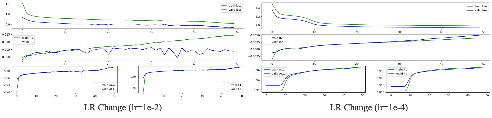
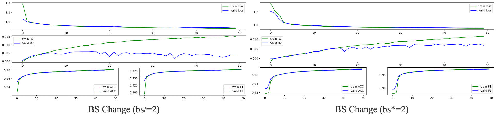
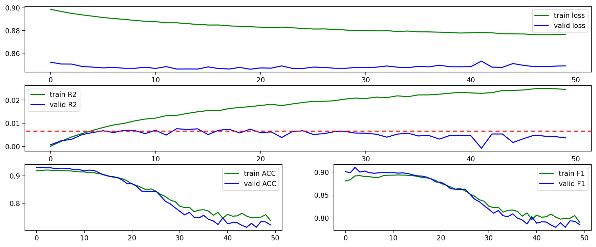
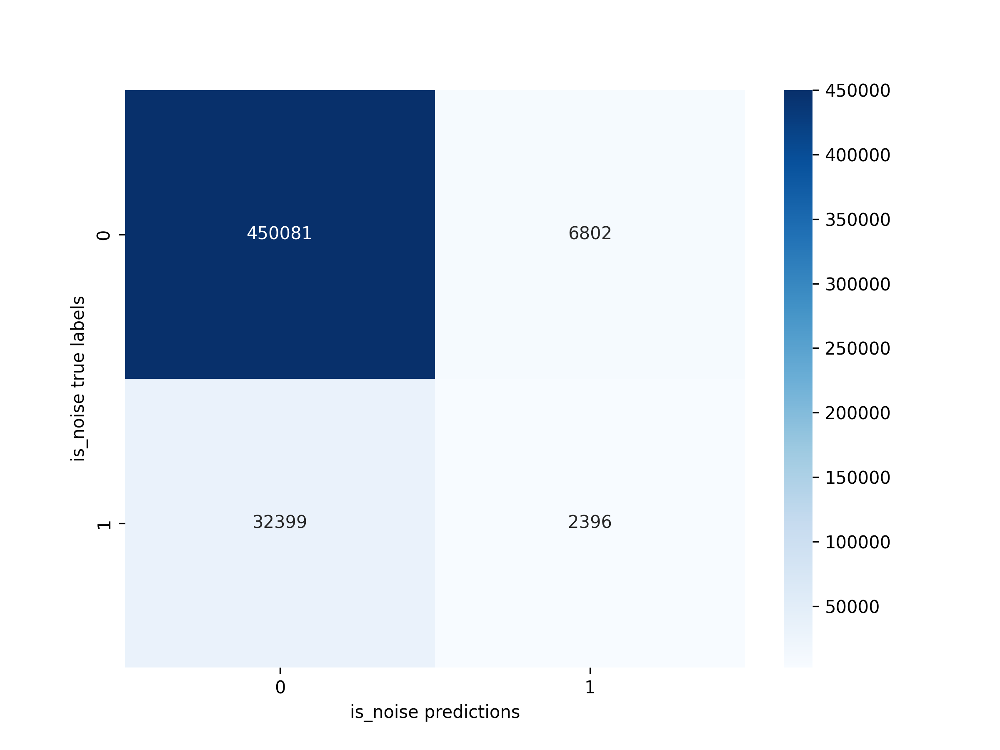

# 基于 XGBoost 的高频交易噪声过滤与多空信号识别

任凯（2024 FinTech，2401212437）

```python
JS-Real-Time-Market-Data-Forecasting/
├── Data/ # Data directory, too big to upload, follow the report to build by yourself.
    ├── train.parquet/ # Download raw data to this directory
    └── dataset/ # Run the code in `data_preprocess/` to get the dataset.
├── CodeXGBoost/ # Code directory
├── Imgs/ # All images used.
├── Doc/ # Documents.
├── README-XGBoost.md # .md format report.
└── requirements.txt # The dependencies. 
```


## 1. Introduction

本作业以 Kaggle 竞赛 Jane Street 数据为例，在第一次作业的基础上将 CNN 模型调整为 XGBoost 模型进行进一步探索。核心目标是：掌握高频交易数据中使用 XGBoost 进行回归建模的基本流程；构建动态加权机制，引导模型更加关注极端下跌样本，提高下行风险预测能力；完成回归模型的参数搜索、性能评估及可视化分析；分析模型在市场噪声过滤中的表现及其实际应用潜力。

本报告尽可能详细展示了作者解答本作业问题的思路，整体的组织架构直接参照助教给出的报告要求。总的来说，本作业解答核心框架如图 1. 所示，共分为**数据集处理、模型搭建和实验三个部分**。具体来看：数据集处理包括从竞赛官网下载原始数据、按照要求进行数据预处理以及重新组织数据三个关键步骤；模型搭建核心在于构造目标数据集、按要求构建模型以及设定合理的超参数集合；在上述两个部分完成后就可以开始进行实验，在训练和验证中调整模型架构和关键超参，进而得到并分析相关实验结果。



<center>图 1. 作业整体框架</center>

需要进一步说明的是，本作业并没有像标准的深度学习项目那样，在训练和验证结束后在测试集上进行进一步测试，核心原因是赛事主办方没有公开合理的测试集，尽管原是数据下载后有 `test` 的部分数据，但是这些数据的组织形式明显是过于模糊、简单化的。因此将本作业的重心放在对量化研究整体流程的理解上，首先通过将主办方提供的训练数据人工划分为训练和验证部分，然后拉通整体流程，最后对结果进行详细分析，在实现作业要求的同时，深刻地理解了各步骤中的处理细节，加深对数据处理、模型构建以及实验的认知。总而言之，本作业想要突出的核心工作如下：

- 本作业搭建了一套通用时序数据建模框架，该框架可以将高频交易时序数据转化为“类图像”数据，并基于 CNN 模型完成信号预测与噪音识别。所有代码目前均已[**开源**](https://github.com/KarryRen/Karry-Studies-AI/tree/main/Cases/JS-Real-Time-Market-Data-Forecasting)。
- 数据处理上：基于对空缺值的探索，筛选关键指标并完成空值填充。进一步地使用 z-score 方法进行特征标准化，最终通过跨时间步和调整形状的方式将时序特征数据调整为通道数为滞后期 `time_step` 的时序张量数据。对于预测标签而言，使用竞赛中衡量评分的关键标签 `responder_6`，同时按要求设计了三级加权机制，对普通下跌和极端下跌样本分别赋予不同权重。
- 模型构造上：搭建 XGBoost 模型，并结合 RandomizedSearchCV 实现对模型的参数优化，同时关注各类超参数的组合效果；
- 实验方案设计上：引入标准 RMSE、加权 RMSE 以及上下行误差对比等多项指标，综合衡量模型预测精度与风险识别能力。

本报告后续按如下结构组织：第 2 节描述了数据处理的详细过程；第 3 节说明了模型构造的具体细节；第 4 节则呈现了实验设计思路及结果；最后在第 5 节呈现了结论与延伸思考。


## 2. Dataset

详细梳理、了解并处理数据集是进行建模的第一步。数据清洗和处理思路和 CNN 部分基本相同，在此仅呈现重点的不一致操作。首先，因为不需要再进行噪音预测，因此将之前数据处理中的噪音生成操作删除。其次，按照要求我设计了三级加权机制，对普通下跌和极端下跌样本分别赋予不同权重。原始数据已经有评分函数中的权重，此处直接对下跌点进行强化即可。responder_6 的分布情况如图 2. 所示，均值基本为 0，存在明显的厚尾效应。基于该图，我将 responder_6 处于 `[-2, 0)` 的区间视为普通下跌样本，权重做 2.5 倍强化；处于 `[-5, -2)` 的区间视为极端下跌样本，权重做 4 倍强化。



<center>图 2. responder_6 的分布情况</center>


## 3. Model

数据处理完成后，按照作业基础要求，搭建了如图 5. 所示的模型框架。



<center>图 5. 模型框架示意图</center>

在此不再赘述模型整体的前向计算操作细节，详情可参考模型部分代码。仅强调，本模型最终输出为多个：一部分为对连续型响应标签的预测，是回归任务；一部分为对 0-1 离散型噪音判别标签的预测，是分类任务。针对前者使用 Mean Squre Error（MSE）损失函数进行监督，针对后者使用 Cross Entropy（CE）损失函数进行监督，二者在训练过程中为相同权重加权。


## 4. Experiment

本作业所有实验均在一张 RTX4090 GPU 上完成。基准实验的超参数如下：学习率 lr 为 1e-3，批大小 bs 为 32,768，大尺度卷积核大小为 5x5，小尺度卷积和大小为 4x4，训练总 Epoch 数为 50。

### 4.1 Metrics

在呈现具体的实验结果之前，先说明对结果的量化指标。针对响应预测的回归任务，此处选择了[**决定系数 R2**](https://zhuanlan.zhihu.com/p/23363675321) 作为指标进行衡量；针对噪声识别的分类任务，此处选择了 [**ACC 和加权 F1 Score**](https://zhuanlan.zhihu.com/p/405658103) 作为指标进行衡量。尽管按照标准论文在此会呈现指标的具体算法，但是这些指标都是极为常见的，在此不再解释其具体含义，给出相关连接以供参考。此处之所以选择加权 F1 Score 是因为噪声分布是不均衡的，也就是说噪声样本点较少，加权求 F1 后才更有参考价值。

进一步地，我们可以结合金融实际场景，分析这些评估指标对业务的含义，尤其是在金融风险管理、交易信号识别等场景下的意义。

- 决定系数 R2：在量化投资中，模型预测的最终落脚点一般都是未来收益。主办方虽然将 `responder_6` 进行了匿名化处理，但其大概率是和未来收益相关的一个响应值，如果能够准确预测该值，那么就可以针对性地“买低卖高”，并通过高频操作获得稳定收益。所以决定系数 R2 这一指标对实际业务而言极为关键，其衡量了预测的准确度，如果在样本外能达到较高值，说明模型预测能力强，收益转化能力高。当然，该值一般都处于比较低的水平，甚至可能为负值，只有将模型调整至 R2 显著为正才能说明训练过程有效，只有 R2 进一步增加才能说明模型有一定的预测能力。
- 分类指标 ACC 和 F1 Score：这二者衡量的都是噪声预测的准确度。在实际的量化操作中，识别噪音是很关键的一环，准确的噪音识别有利于风险控制和交易机会把握。但是该任务相对来说较为简单，就像前面提到的那样，根据过往数据的均值方差，就可以计算出波动程度，进而判断出当前特征值是否处于噪声区域。对于本作业而言，因为识别任务简单，这两个指标应该都很高，这一点也可以在后续的实验结果中得到验证。

### 4.2 Results

为了尽可能全面地了解模型性能，体会各超参数对训练结果的影响。此处实验思路如下：首先根据基准超参数完成基准实验；然后调整学习率、批大小、卷积核大小进行对照实验分析相关超参数的影响；最后进行任务消融实验探索噪音识别任务是否有助于模型预测能力的提升。在验证集数据上得到的具体实验指标结果如表 1. 所示，相关含义和结果分析将在后续一步步进行。

<center>表 1.  实验结果汇总</center>

| Method                           | R2     | ACC    | F1 Score |
| -------------------------------- | ------ | ------ | -------- |
| Baseline                         | 0.0069 | 0.9744 | 0.9733   |
| LR Change (lr=1e-2)              | 0.0062 | 0.9791 | 0.9780   |
| LR Change (lr=1e-3)              | 0.0049 | 0.9639 | 0.9611   |
| BS Change (bs/=2)                | 0.0076 | 0.9729 | 0.9720   |
| BS Change (bs*=2)                | 0.0059 | 0.9746 | 0.9739   |
| Conv Change (both 3x3)           | 0.0071 | 0.9762 | 0.9753   |
| Conv Change (both 5x5)           | 0.0079 | 0.9723 | 0.9717   |
| Ablation Study (Only Regression) | 0.0077 | 0.9203 | 0.8982   |

再次强调，由于测试集是不存在的，所以在此我不是只专注于分析在验证集上最优模型的指标表现，而是更关注整体的训练和验证过程，尤其是相关指标和损失函数在多轮训练中的波动情况，这样的分析才有意义！

**Part 1. 基准实验**

基准实验（Baseline）的训练及验证过程如图 6. 所示。一方面，可以看到训练集上损失下降并逐渐收敛，说明代码框架合理正确。另一方面，查看三个指标：对于回归任务而言 R2 在训练集上不断增加，在验证集上达到稳定后进行波动，有一定的过拟合出现，但值都比较低，复合预期；对于分类任务而言 ACC 和 F1 Score 在训练和测试集合上都不断增加，且值都比较高，核心原因是分类任务简单直接。



<center>图 6. 基准模型训练及验证过程</center>

图 7. 呈现了 Baseline 的噪音分类混淆矩阵，可以看到尽管全局的 ACC 较高，但因为数据存在偏差，对于噪音点的识别精度还有待提升。



<center>图 7. 基准模型验证集混淆矩阵</center>

**Part 2. 超参数对照实验**

此处，我针对学习率、批大小和卷积核大小三组超参数进行调整并给出对照实验结果。首先是学习率，我尝试在其他条件不变的情况下将学习率分别增大到原来的 10 倍（LR Change 1e-2）或缩小为原来的 1/10（LR Change 1e-4），得到如图 8. 所示的实验结果。比较可得：增大学习率对最终指标几乎没有影响，但是会显然提高学习速度，进而扩大过拟合程度；缩小学习率显著降低了指标精度，从训练过程上也可以明显发现是因为学习率过低，模型还未完全收敛导致其处于欠拟合的状态。因此正如上课邹老师讲述的那样，选择适配任务的学习率十分重要，过大导致波动明显，过小导致收敛速度慢，可以在合适的区间进行尝试进而找到恰当的数值。



<center>图 8. 调整学习率实验训练及验证过程</center>

其次是批大小，我尝试在其他条件不变的情况下将批大小分别缩小为原来的 1/2（BS Change bs/=2）或增大到原来的 2 倍（BS Change bs*=2）或，得到如图 9. 所示的实验结果。可以发现：当批大小缩小时训练过程更加陡峭（过拟合出现得更早），这核心是因为其缩小时每次迭代选择的样本量变小，梯度更为陡峭，收敛速度更快，但最终指标精度区别不大；反之当批大小增大时训练更为平缓（过拟合出现得更晚），这是因为每次迭代得到的梯度更平缓，收敛速度也更慢，但最终指标精度同样区别不大。总的来说批大小对训练结果的影响没那么明显，但在实际操作中，为了尽可能提高训练速度，往往会在硬件适配的情况下选择较大的批大小。



<center>图 9. 调整批大小实验训练及验证过程</center>

最后是卷积核大小，基准模型的第一步处理拥有 3x3 和 5x5 两种卷积核，以期提取不同尺度的信息，我尝试将两个卷积核均变为 3x3（Conv Change both 3x3） 或均变成 5x5（Conv Change both 5x5）以和基准设置产生“非多尺度”的对照实验，得到如图 10. 所示的实验结果。不难发现：卷积核无论是都变成小尺度还是都变成大尺度，指标结果基本一致，且训练及验证过程也基本没有差别。这可能说明采用此处“多尺度”信息提取没有带来信息增量，只要能够使用卷积核将信息进行编码提取就能得到较好的效果。但也可能是因为后续 SE 模块的加权处理，弥补了多尺度信息的缺失，这需要对 SE 模块进行进一步的对照实验，但由于时间限定，未能进行尝试，可在未来做更深层的探讨。


<center>图 10. 调整卷积核大小实验训练及验证过程</center>

总得来说，学习率和批大小这两组参数的调整复合理论预期，卷积核大小调整基本未带来变化。

**Part 3. 任务消融实验**

尽管本项目模型能够输出响应预测和噪声预测两个任务结果，但在实际工程中噪声识别的目的也是辅助提高未来收益率的预测精度，同时提高模型的鲁棒性。因此模型主任务是响应预测，辅任务是噪声预测。那么本场景下，主辅任务联合建模是否真得能够提高主任务的预测精度呢？这是一个值得思考的问题。于是我搭建了只有预测响应信号的回归单任务实验（Ablation Study Only Regression）并得到如图 11. 所示的实验结果。可以发现：分类任务无法得到训练，指标精度不高，复合预期。但和预期有所偏差的是，回归任务的指标精度没有明显变化，只是在训练过程中出现了早且更明显的过拟合现象。这说明目前的主辅任务没能较好地提升主任务精度，这可能和噪声识别任务设定过于简单相关，后续可考虑将其调整为考虑未来情形的噪声判断。但是这种多任务设定的确很好地保证了训练的稳定性，降低了主任务的过拟合程度。



<center>图 11. 回归单任务消融实验训练及验证过程</center>

在此，需要进一步说明的在表 1. 中尽管 Ablation Study (Only Regression) 实验 ACC 和 F1 Score 仍处于一个不错的水平，但实际上该模型已经没有任何噪声识别能力，这一点在图 12. 混淆矩阵中就能够展现得淋漓尽致：该模型在噪声样本点上的识别正确率不足 10%！



<center>图 12. 回归单任务模型验证集混淆矩阵</center>


## 5. Conclusion

本报告详细呈现了作业完成思路，作业代码框架。实验结果基本说明了整体思路和框架的正确性，同时呈现出了和理论相同的学习率、批大小等超参的指标影响趋势，另外也探究了卷积核大小导致信息提取尺度不同所带来的影响，最后还说明了主辅任务搭建的作用。

总之，本次作业完成过程充分延伸了邹老师上课所讲的基础知识，更为深刻、具体地认识到了理论含义，在实际编码过程中对人工智能项目框架也有了更为清晰的理解。

本报告所用数据、方法、代码目前均已开源。未来将针对主辅任务搭建以及 SE 模块的消融实验进行更为详细的探索和说明。


## References

Hu, Jie, Li Shen, and Gang Sun. "Squeeze-and-excitation networks." *Proceedings of the IEEE conference on computer vision and pattern recognition*. 2018.
