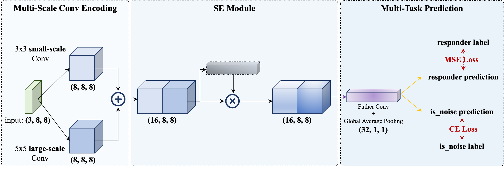
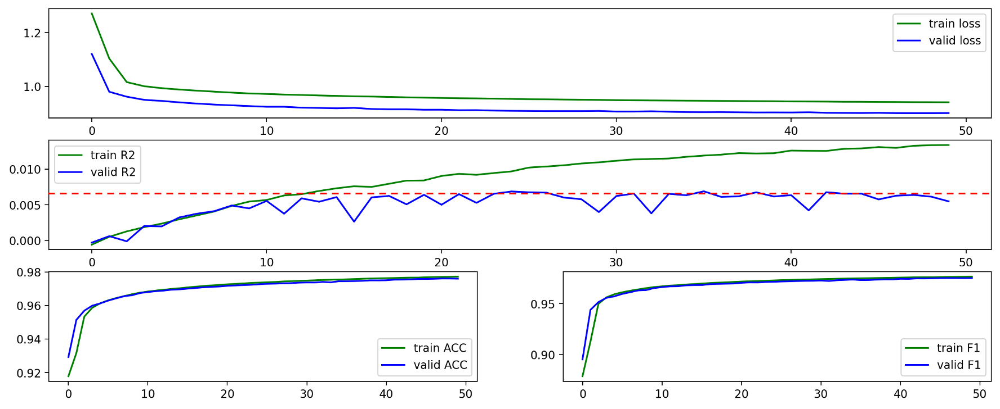
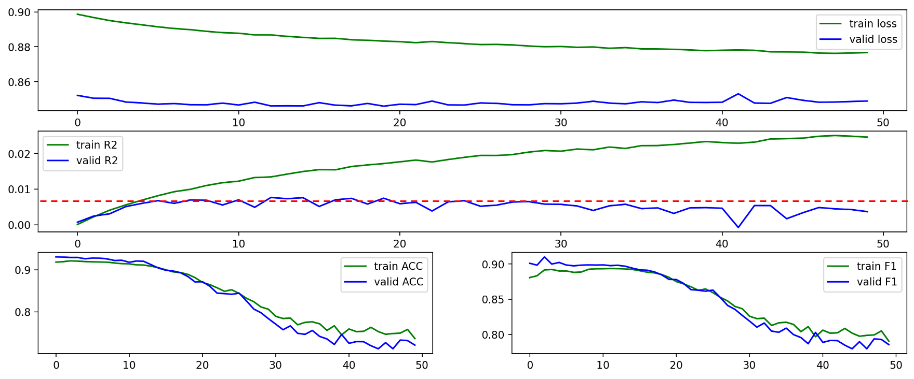
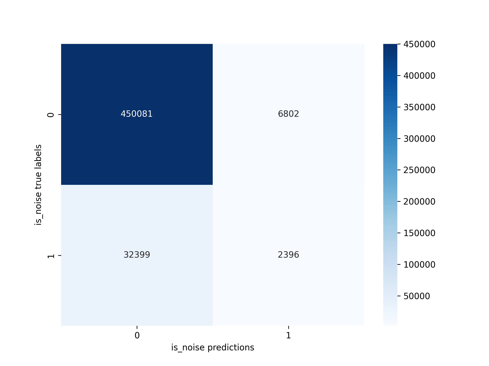

# 基于 CNN 的高频交易噪声过滤与多空信号识别

任凯（2024 FinTech，2401212437）

```python
JS-Real-Time-Market-Data-Forecasting/
├── Data/ # Data directory, too big to upload.
    ├── train.parquet/ # Download raw data to this directory
    └── dataset/ # Run the code in `data_preprocess/` to get the dataset.
├── Code/ # Code directory
    ├── data_preprocess/ # Code for data prprocessing.
        ├── main.py # The pipline.
        └── utils.py # The utils functions.
    ├── datasets/ # The dataset.
        └── jsmp_dataset.py # Dataset module.
    ├── models/ # The model codes.
        ├── net.py # Network.
        ├── modules.py # Important modules.
        ├── loss.py # Loss functions.
        └── metrics.py # Metrics functions.
    ├── config.py # Related configs.
    ├── train_valid_model.py # The pipline to train & valid model.
    ├── pred_model.py # The pipline to test model
    └── utils.py # The utils functions.
```

## 1. Introduction

本作业以 Kaggle 竞赛 Jane Street 数据为例，展示 CNN 在时序数据处理中的特征提取与降噪方法，理解高频交易数据的特性与挑战。作业的核心目的是为了培养金融工程的系统性思维，帮助同学们建立从数据清洗、特征工程到模型构建与训练的完整量化研究流程，初步具备构建金融智能策略系统的能力。

本报告尽可能详细展示了作者解答本作业问题的思路，整体的组织架构直接参照助教给出的报告要求。总的来说，本作业解答核心框架如图 1. 所示，共分为**数据集处理、模型搭建和实验三个部分**。具体来看：数据集处理包括从竞赛官网下载原始数据、按照要求进行数据预处理以及重新组织数据三个关键步骤；模型搭建核心在于构造目标数据集、按要求构建模型以及设定合理的超参数集合；在上述两个部分完成后就可以开始进行实验，在训练和验证中调整模型架构和关键超参，进而得到并分析相关实验结果。


<center>图 1. 作业整体框架</center>

需要进一步说明的是，本作业并没有如标准的神经网络项目那样，在训练、验证结束后在测试集上进一步测试，这核心是因为赛事主办方没有公开合理正确的测试集，尽管原是数据下载后有 `test` 的部分数据，但是这些数据的组织形式明显是过于模糊、简单化的。因此将本作业的重心放在对量化研究整体流程的理解上，首先通过将主办方提供的训练数据人工划分为训练和验证部分，然后拉通整体流程，最后对结果进行详细分析，在实现作业要求的同时，深刻地理解了各步骤中的处理细节，加深对数据处理、模型构建以及实验的认知。总而言之，本作业想要突出的核心工作如下：

- 本作业搭建了一套通用时序数据建模框架，该框架可以将高频交易时序数据转化为“类图像”数据，并基于 CNN 模型完成信号预测与噪音识别。所有代码目前均已[**开源**](https://github.com/KarryRen/Karry-Studies-AI/tree/main/Cases/JS-Real-Time-Market-Data-Forecasting)。
- 数据处理上：基于对空缺值的探索，筛选关键指标并完成空值填充。进一步地使用 z-score 方法进行特征标准化，最终通过跨时间步和调整形状的方式将时序特征数据调整为通道数为滞后期 `time_step`，大小为 `(h, w)` 的"类图像"的三位张量数据。对于预测标签而言，首先保留了竞赛中衡量评分的关键标签 `responder_6`，其次根据特征偏离程度搭建了噪声识别标签 `is_noise`。
- 模型构造上：搭建的 Multi-CNN 模型，一方面在识别尺度上具有 “Multi” 特性，既有小尺度卷积操作也有较大尺度的卷积操作；另一方面在预测目标上具有 “Multi” 特性，既能输出对连续性标签 `responder_6` 的预测，又能输出对离散性标签 `is_noise` 的预测。
- 实验方案设计上：不仅对作业要求的学习率、卷积核大小、批大小等超参数进行调整与比较，而且对多任务训练进行消融实验，检测噪声识别任务对响应标签预测是否有帮助。

本报告后按如下结构组织：第 2 节描述了数据处理的详细过程；第 3 节说明了模型构造的具体细节；第 4 节则呈现了实验设计思路及结果；最后在第 5 节呈现了结论与延伸思考。


## 2. Dataset

详细梳理、了解并处理数据集是进行建模的第一步。本节将详细介绍原始数据集特征，并呈现预处理过程与结果，框架如图 2. 所示。


<center>图 2. 数据集处理框架</center>

### 2.1 Dataset Description

本作业数据集来自 Kaggle 上 Jane Street 发起的一个[**竞赛**](https://www.kaggle.com/competitions/jane-street-real-time-market-data-forecasting/overview)。此数据库本质是匿名处理的真实交易数据，但由于比赛限制我们无法拿到合理的 test 数据针对真实情况进行调优，因此本作业解答专注在对 train 数据集上的研究，且不调用主办方提供的测试数据和接口，以实现更加完整、流畅的练习目的，并呈现相对清晰、泛化的解题思路和框架。在此我对训练数据 `train.parquet` 进行了如下详细描述。

首先，在竞赛主页上完成**原始数据**下载后，能够得到如下的训练数据文件结构，此处分成了 `id` 从 0 到 9 共十个部分进行存储，文件类型为 `.parquet`，**总内存约占 12.3 GB**。考虑到原始数据量过大，后续处理过于耗时，因此本作业解答只选取了了 `id` 从 0 到 3 的共四部分数据进行建模。其中共包含 680 日下的 11,802,114 条交易数据，共出现 29 种交易标的。

```python
train.parquet/
├── partition_id=0
    └── part-0.parquet
├── partition_id=1
    └── part-1.parquet
├── ...
└── partition_id=9
    └── part-9.parquet
```

其次，读取数据并结合官方描述，可以得到对**数据字段**更详细的说明，在此进行梳理。数据共含有有 92 个字段，可分为如下 4 类：

- 标识性字段（3 个）
  - `date_id` 和 `time_id`： 按顺序排序的整数值，为数据提供时间顺序结构，尽管 `time_id` 值之间的实际时间间隔有所不同。
  - `symbol_id`：匿名化的标的代码，唯一标识。
- 权重字段（1 个）
  - `weight`：用于计算评分函数的权重。
- 特征字段（79 个）
  - `feature_00` 到 `feature_78`：共 79 个匿名市场特征数据。
- 响应字段（9 个）
  - `responder_0` 到 `responder_8`：共 9 个匿名响应者，介于 -5 和 5 之间。`responder_6` 是预测目标。

总之，数据集中的每一行都对应一个标的（用标识 `symbol_id` 标识）和一个时间戳（用 `date_id`和 `time_id` 标识）的唯一组合。`date_id` 列是一个整数，表示事件发生的日期，而 `time_id` 表示时间顺序。需要注意的是，它们之间的实际时间差异 `time_id` 不能保证一致。**注意**：`symbol_id` 字段实际是加密标识符，但不保证每个标识符都会出现在所有 `time_id` 和 `date_id` 组合中。

### 2.2 Data Preprocess

详细阅读原始数据后，可以发现数据本身存在较多问题，无法对其直接建模。因此需要使用多步骤的预处理，进行数据重构，此处的核心步骤共有四步骤，具体说明如下。

**Step 1. 减少数据占存：筛选目标列，修改数据类型**

原始数据占存较大，为提高后续操作速度，在此我先进行了数据减存操作。一方面，在响应字段中只保留预测目标 `responder_6`，这样数据总字段数变为 84 个。另一方面，对剩余的每个字段进行数据类型规范化，通过修改数据类型以减少大约 48.6% 的占存（从 3612.97 MB 到 1857.14 MB）。

**Step 2. 处理空缺值**

正如数据描述中所介绍的那样，不同日期下的 `symbol_id` 情况存在区别，在一些日期中存在标的标识符的缺失。这和现实交易情况是相符的，一方面某些标的在初期可能还没上市，另一方面标的可能会因为特殊原因停止交易，这都会导致特定日期缺失一些标的交易信息。仔细观察图 3. 可以发现，在原始数据涵盖的 680 个交易日里，前 500 天交易日中的 `symbol_id` 数量较少，较比全局而言缺省较多，这说明前 500 天的交易数据与全局相比，可能是有偏的，这对整体建模十分不利。因此针对 `symbol_id` 的空缺，我选择直接将前 500 个交易日数据进行剔除，仅选取后 180 个交易日下的共 9,274,909 条交易数据进行后续处理。


<center>图 3. 每一个交易日中标的数量</center>

进一步地，需要对特征数据的空值进行观察和处理。如图 4. 左上所示，部分特征值存在 10% 以上的空值。根据时序特征的性质，首先可以根据 `symblo_id` 分组后进行 `ffill` 填充，即将空值填充为前一个距离最近的非空值，填充后如图 4. 右上所示，可发现部分特征的空值比例显著下降。然后对仍有空值的特征进行描述性统计，根据描述性信息删除了 15 个特征，具体来看：先将前 13 个缺省较多的特征直接删除，然后删除 `feature_73` 和 `feature_74` 两个空值比例相对较高且分布偏差较大的特征。最后对存在空值的特征按照标的分组后使用中值进行填充。数据集最终还有 64 个特征。


<center>图 4. 特征填空值过程</center>

**Step 3. 数据归一化，与噪声识别构造**

使用全局 z-score 方法进行归一化，调整数据分布。请注意：此处全局 z-score 只是对现实情形的模拟，现实中可以根据过往数据信息获得对全局均值方差的估计，但此处因为数据有限，所以只能用全局数据进行估计，这虽然会导致部分未来信息泄漏，但是体现了核心思想，在此便不做更多讨论。注意到，标准化后很多值仍存在较大偏差，此处根据标准差偏移量构造噪声识别标签。代表一个样本点的一行数据中，如果其有任一个特征值偏差的绝对值大于 4.5，就将该样本点标记为噪音。此处标签是 0-1 二分变量，方便后续多任务学习，0 表示不是噪音，1 表示是噪音。

**Step 4. 时序数据重构**

首先按照日期将数据集划分为训练和验证两个部分，将 180 个交易日中的前 160 天作为训练集，后 20 日天作为验证集。然后进行时序数据滞后处理：按照标的分组，组内用日期和时间排序，选择 `time_step = 3`，即同时看当前时间戳以及前两步的信息。最后对数据进行“类图片”特征重构：目前数据中剩余 64 个特征，将其按顺序重构为 6\*6 的图片，结合滞后处理也就是形状为 `(3, 8, 8)` 的三维张量。其中：“通道数 = 3“表示时间步上的三个表达，“宽\*高 = 6*6”表示特征信息尺度。还需说明的是，因为此处进行了滞后处理，所以只要三个时间步内有一条数据被标记为噪音，那么该样本噪音标签就是 1，否则为 0。


## 3. Model

数据处理完成后，按照作业基础要求，搭建了如图 5. 所示的模型框架。



<center>图 5. 模型框架示意图</center>

在此不再赘述模型整体的前向计算操作细节，详情可参考模型部分代码。仅强调，本模型最终输出为多个：一部分为对连续型响应标签的预测，是回归任务；一部分为对 0-1 离散型噪音判别标签的预测，是分类任务。针对前者使用 Mean Squre Error（MSE）损失函数进行监督，针对后者使用 Cross Entropy（CE）损失函数进行监督，二者在训练过程中为相同权重加权。


## 4. Experiment

本作业所有实验均在一张 RTX4090 GPU 上完成。基准实验的超参数如下：学习率 lr 为 1e-3，批大小 bs 为 32,768，大尺度卷积核大小为 5x5，小尺度卷积和大小为 4x4，训练总 Epoch 数为 50。

### 4.1 Metrics

在呈现具体的实验结果之前，先说明对结果的量化指标。针对响应预测的回归任务，此处选择了[**决定系数 R2**](https://zhuanlan.zhihu.com/p/23363675321) 作为指标进行衡量；针对噪声识别的分类任务，此处选择了 [**ACC 和加权 F1 Score**](https://zhuanlan.zhihu.com/p/405658103) 作为指标进行衡量。尽管按照标准论文在此会呈现指标的具体算法，但是这些指标都是极为常见的，在此不再解释其具体含义，给出相关连接以供参考。此处之所以选择加权 F1 Score 是因为噪声分布是不均衡的，也就是说噪声样本点较少，加权求 F1 后才更有参考价值。

进一步地，我们可以结合金融实际场景，分析这些评估指标对业务的含义，尤其是在金融风险管理、交易信号识别等场景下的意义。

- 决定系数 R2：在量化投资中，模型预测的最终落脚点一般都是未来收益。主办方虽然将 `responder_6` 进行了匿名化处理，但其大概率是和未来收益相关的一个响应值，如果能够准确预测该值，那么就可以针对性地“买低卖高”，并通过高频操作获得稳定收益。所以决定系数 R2 这一指标对实际业务而言极为关键，其衡量了预测的准确度，如果在样本外能达到较高值，说明模型预测能力强，收益转化能力高。当然，该值一般都处于比较低的水平，甚至可能为负值，只有将模型调整至 R2 显著为正才能说明训练过程有效，只有 R2 进一步增加才能说明模型有一定的预测能力。
- 分类指标 ACC 和 F1 Score：这二者衡量的都是噪声预测的准确度。在实际的量化操作中，识别噪音是很关键的一环，准确的噪音识别有利于风险控制和交易机会把握。但是该任务相对来说较为简单，就像前面提到的那样，根据过往数据的均值方差，就可以计算出波动程度，进而判断出当前特征值是否处于噪声区域。对于本作业而言，因为识别任务简单，这两个指标应该都很高，这一点也可以在后续的实验结果中得到验证。

### 4.2 Results

为了尽可能全面地了解模型性能，体会各超参数对训练结果的影响。此处实验思路如下：首先根据基准超参数完成基准实验；然后调整学习率、批大小、卷积核大小进行对照实验分析相关超参数的影响；最后进行任务消融实验探索噪音识别任务是否有助于模型预测能力的提升。在验证集数据上得到的具体实验指标结果如表 1. 所示，相关含义和结果分析将在后续一步步进行。

<center>表 1.  实验结果汇总</center>

| Method                           | R2     | ACC    | F1 Score |
| -------------------------------- | ------ | ------ | -------- |
| Baseline                         | 0.0069 | 0.9744 | 0.9733   |
| LR Change (lr=1e-2)              | 0.0062 | 0.9791 | 0.9780   |
| LR Change (lr=1e-3)              | 0.0049 | 0.9639 | 0.9611   |
| BS Change (bs/=2)                | 0.0076 | 0.9729 | 0.9720   |
| BS Change (bs*=2)                | 0.0059 | 0.9746 | 0.9739   |
| Conv Change (both 3x3)           | 0.0071 | 0.9762 | 0.9753   |
| Conv Change (both 5x5)           | 0.0079 | 0.9723 | 0.9717   |
| Ablation Study (Only Regression) | 0.0077 | 0.9203 | 0.8982   |

再次强调，由于测试集是不存在的，所以在此我不是只专注于分析在验证集上最优模型的指标表现，而是更关注整体的训练和验证过程，尤其是相关指标和损失函数在多轮训练中的波动情况，这样的分析才有意义！

**Part 1. 基准实验**

基准实验（Baseline）的训练及验证过程如图 6. 所示。一方面，可以看到训练集上损失下降并逐渐收敛，说明代码框架合理正确。另一方面，查看三个指标：对于回归任务而言 R2 在训练集上不断增加，在验证集上达到稳定后进行波动，有一定的过拟合出现，但值都比较低，复合预期；对于分类任务而言 ACC 和 F1 Score 在训练和测试集合上都不断增加，且值都比较高，核心原因是分类任务简单直接。



<center>图 6. 基准模型训练及验证过程</center>

图 7. 呈现了 Baseline 的噪音分类混淆矩阵，可以看到尽管全局的 ACC 较高，但因为数据存在偏差，对于噪音点的识别精度还有待提升。


<center>图 7. 基准模型验证集混淆矩阵</center>

**Part 2. 超参数对照实验**

此处，我针对学习率、批大小和卷积核大小三组超参数进行调整并给出对照实验结果。首先是学习率，我尝试在其他条件不变的情况下将学习率分别增大到原来的 10 倍（LR Change 1e-2）或缩小为原来的 1/10（LR Change 1e-4），得到如图 8. 所示的实验结果。比较可得：增大学习率对最终指标几乎没有影响，但是会显然提高学习速度，进而扩大过拟合程度；缩小学习率显著降低了指标精度，从训练过程上也可以明显发现是因为学习率过低，模型还未完全收敛导致其处于欠拟合的状态。因此正如上课邹老师讲述的那样，选择适配任务的学习率十分重要，过大导致波动明显，过小导致收敛速度慢，可以在合适的区间进行尝试进而找到恰当的数值。


<center>图 8. 调整学习率实验训练及验证过程</center>

其次是批大小，我尝试在其他条件不变的情况下将批大小分别缩小为原来的 1/2（BS Change bs/=2）或增大到原来的 2 倍（BS Change bs*=2）或，得到如图 9. 所示的实验结果。可以发现：当批大小缩小时训练过程更加陡峭（过拟合出现得更早），这核心是因为其缩小时每次迭代选择的样本量变小，梯度更为陡峭，收敛速度更快，但最终指标精度区别不大；反之当批大小增大时训练更为平缓（过拟合出现得更晚），这是因为每次迭代得到的梯度更平缓，收敛速度也更慢，但最终指标精度同样区别不大。总的来说批大小对训练结果的影响没那么明显，但在实际操作中，为了尽可能提高训练速度，往往会在硬件适配的情况下选择较大的批大小。


<center>图 9. 调整批大小实验训练及验证过程</center>

最后是卷积核大小，基准模型的第一步处理拥有 3x3 和 5x5 两种卷积核，以期提取不同尺度的信息，我尝试将两个卷积核均变为 3x3（Conv Change both 3x3） 或均变成 5x5（Conv Change both 5x5）以和基准设置产生“非多尺度”的对照实验，得到如图 10. 所示的实验结果。不难发现：卷积核无论是都变成小尺度还是都变成大尺度，指标结果基本一致，且训练及验证过程也基本没有差别。这可能说明采用此处“多尺度”信息提取没有带来信息增量，只要能够使用卷积核将信息进行编码提取就能得到较好的效果。但也可能是因为后续 SE 模块的加权处理，弥补了多尺度信息的缺失，这需要对 SE 模块进行进一步的对照实验，但由于时间限定，未能进行尝试，可在未来做更深层的探讨。


<center>图 10. 调整卷积核大小实验训练及验证过程</center>

总得来说，学习率和批大小这两组参数的调整复合理论预期，卷积核大小调整基本未带来变化。

**Part 3. 任务消融实验**

尽管本项目模型能够输出响应预测和噪声预测两个任务结果，但在实际工程中噪声识别的目的也是辅助提高未来收益率的预测精度，同时提高模型的鲁棒性。因此模型主任务是响应预测，辅任务是噪声预测。那么本场景下，主辅任务联合建模是否真得能够提高主任务的预测精度呢？这是一个值得思考的问题。于是我搭建了只有预测响应信号的回归单任务实验（Ablation Study Only Regression）并得到如图 11. 所示的实验结果。可以发现：分类任务无法得到训练，指标精度不高，复合预期。但和预期有所偏差的是，回归任务的指标精度没有明显变化，只是在训练过程中出现了早且更明显的过拟合现象。这说明目前的主辅任务没能较好地提升主任务精度，这可能和噪声识别任务设定过于简单相关，后续可考虑将其调整为考虑未来情形的噪声判断。但是这种多任务设定的确很好地保证了训练的稳定性，降低了主任务的过拟合程度。



<center>图 11. 回归单任务消融实验训练及验证过程</center>

在此，需要进一步说明的在表 1. 中尽管 Ablation Study (Only Regression) 实验 ACC 和 F1 Score 仍处于一个不错的水平，但实际上该模型已经没有任何噪声识别能力，这一点在图 12. 混淆矩阵中就能够展现得淋漓尽致：该模型在噪声样本点上的识别正确率不足 10%！



<center>图 12. 回归单任务模型验证集混淆矩阵</center>

## 5. Conclusion
