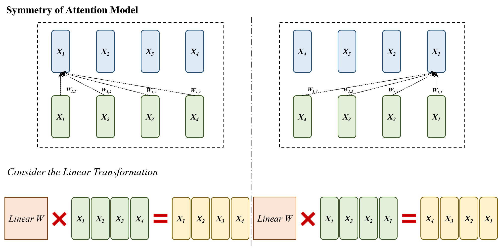

# Questions about Transformer

> 有关 Transformer 总会有各种各样细致的问题，在此进行汇总。

## Symmetry of Attention Model 

> 对于 Attention 函数 $f()$ 而言，其一定有一个性质 $f(reverse(x)) == reverse(f(x))$，为什么会这样 ？

首先，我们可以用[**代码**](./symmetry.py)检验一下，发现这种现象的确存在。

其次，我们可以从下图的理论推导中得出，这种现象在 Attention Model 中具有一般性。

