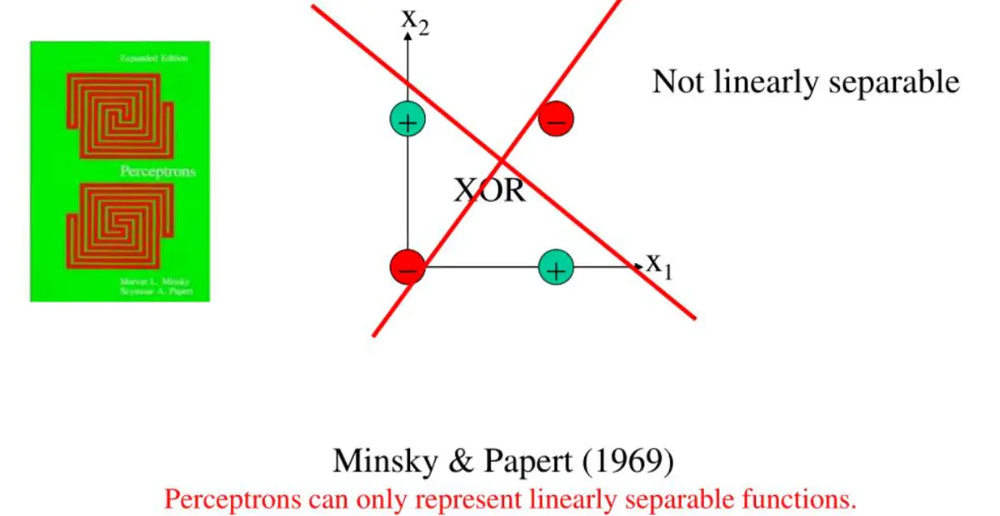
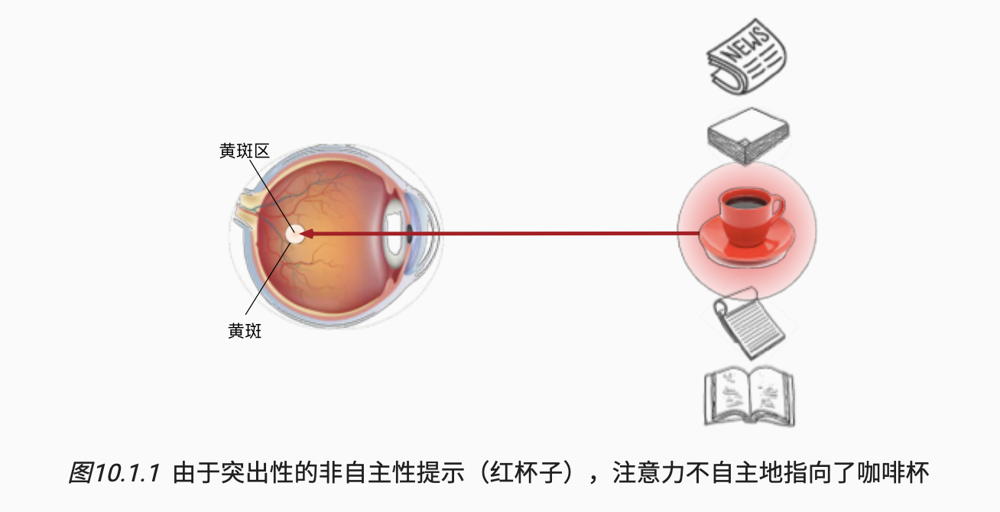
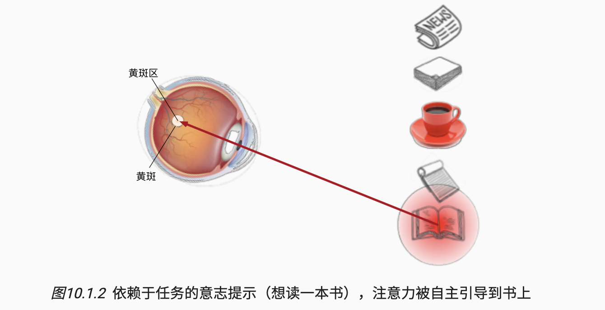
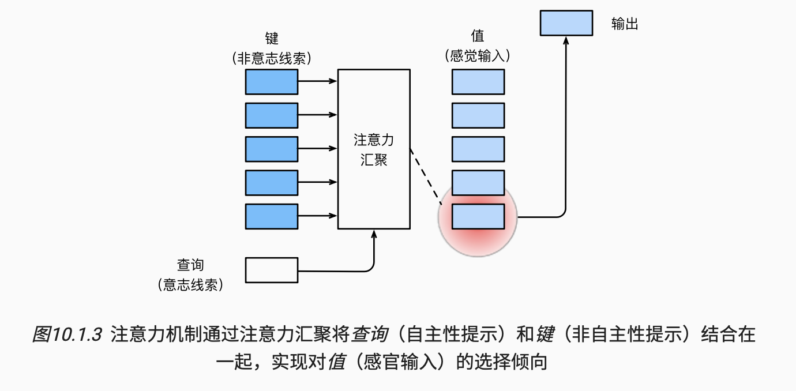

# 动手学深度学习 —— 李沐

> [**课程网站**](https://courses.d2l.ai/zh-v2/)；[**电子教材**](https://zh-v2.d2l.ai/chapter_preface/index.html)；[**教材 Repo**](https://github.com/d2l-ai/d2l-zh)；
>
> 本课程我在 2022 年系统性学习过本课程，后续在科研和实践过程中还是觉得自己的一些理解不够到位，同时对于一些知识也有了新的看法和体会，因此在 2024 年初又开始重新学习，主要为了实现以下三点贡献： 
>
> 1. **系统性地梳理框架**，填充自己的学习实践感悟，构建起清晰且扎实地**深度学习脉络**
> 2. 搭建起自己的**深度学习知识库**，方便后续相关内容的收集与整理，本笔记将成为个人的**深度学习基础宝典**
> 3. 书写**清晰完整的笔记内容**，为交流分享提供便利 
>
> 学习时沐神告诫我们要不断地、努力地询问 What, How, Why。自己未来的规划也想在 Why 和 How 上多下文章，因此要始终勤于思考，善于发问，善于总结和延伸！共勉！

## 0～18. Fundation

> **<u>Code</u>** : `00_to_18_Fundation/`
>
> - 线性代数基础：线性代数中的基本概念和基本运算方式
> - 矩阵求导：矩阵求导的基础知识
> - 线性神经网络：包括 **1、线性回归**和 **2、 Softmax 回归**
> - 多层感知机：引入非线性运算增强表达性
> - 超参：关于超参的细节，和调参的一些心得
> - Optimizer：模型优化的一些基础概念

### 线性代数基础 

向量乘法的本质是扭曲空间。

**L1 范数和 L2 范数**的计算公式分别为：
$$
\Vert x \Vert_1 = \sum_{i = 1}^n\{x_i\} \\
\Vert x \Vert_2 = \sqrt{\sum_{i = 1}^n{x_i^2}}
$$
对于矩阵而言，其 **Frobenius Norm** 为：
$$
\Vert X \Vert = \sqrt{\sum_{i=0}^n\sum_{j=0}^m{x_{i,j}^2}}
$$

### 矩阵求导

**亚导数**是指对不可导函数的不可导点设定一个固定的值，比如 $y = |x|$ 或 $y = \mathrm{Relu}(x)$ 。

**向量求导**，关键是**搞清楚形状**，正如下面这幅图所示，存在四种情况。在实际应用中，尤其是卷积等操作往往都是更高维度的计算，但一般而言都存在求和或者求平均（Loss 一般是个标量）的操作，所以很少会出现矩阵对矩阵求导出现高维矩阵的情况，在此不赘述矩阵间的求导运算。


我们分别对这四种情况构造一个例子。

- **标量对标量求导**： $y = x^2$，求导可得 $\frac{\mathrm{d}y}{\mathrm{d}x} = 2x$，那么当 $x = 2$ 时导数为 $4$

- **标量对标量求导**：$x$ 是一个列向量，$y$ 是一个标量，导数是一个行向量，一个简单的例子 $y = x_1^2 + x_2^2$，求导可得 $\frac{\mathrm{d}y}{\mathrm{d}x} = \{\frac{\mathrm{d}y}{\mathrm{d}x_1},\frac{\mathrm{d}y}{\mathrm{d}x_2}\}$，从数学形式上或许不好理解其导数的含义，但是从形状上可以得到，**导数和等高线的切线正交向外**，也即数值增长最快的地方。

- **向量对标量求导**：$y$ 是一个列向量 $x$ 是一个标量，导数是一个列向量，一个简单的例子 $y_1 = 2x, y_2 = 3x$，求导可得 $\frac{\mathrm{d}y}{\mathrm{d}x} = \{\frac{\mathrm{d}y_1}{\mathrm{d}x},\frac{\mathrm{d}y_2}{\mathrm{d}x}\}$。

- **向量对向量求导**：得到一个矩阵，其含义是十分清晰简单的，也就是一个列向量 $y$ 的每一个元素对另一个列向量 $x$ 求导得到一个行向量做行。

  

**向量的链式求导法则**是梯度下降的核心所在，本质是对上述四种情况的组合，下面有一个**线性回归的例子**：

- 首先，是只有一个 Sample ，每个 Sample 有 n 维 Feeature 的例子（Loss 是 MSE）

  

- 其次，是有 bs (m) 个 Sample，每个 Sample 仍然有 n 维 Feature 的例子（Loss 是 MSE 求和）

  

**计算图自动求导**，TF 是需要用户显示构造计算图（之前了解过一些 TF 的知识，感觉十分难用），Pytorch 则不需要是隐式的。自动求导有两种方式，一种是正向累计，一种是反向传播。对于一个有 n 个计算节点的计算图而言，二者相似点在于内存复杂度，都需要**保存计算图中每一个节点的值也即 O(n)**，所以都十分消耗空间；不同点在于，反向求导的计算整张图复杂度为 O(n)，而正向累计计算每一个节点的复杂度都是 O(n)。框架自动求导都选择反向传播的思路，在训练时 `.train()` 由于存在 `forward()` 和 `backward()` 两个操作，所以比较耗时。

因此在构造神经网络 `forward()` 函数的时候，**就是在构造一张计算图**，如果想要将其中的某个值从图中分离出来，就可以用 `.detach()` 来做，来看一个例子：

```python
x = torch.range(0, 3, requires_grad=True)
u = x * x
y = u * x
y.sum().backward()
print(x.grad)
# [0, 3, 12, 27] = 3x^2

x.grad.zero_()

u = x * x
y = u.detach() * x
y.sum().backward()
print(x.grad)
# [0, 1, 4, 9] = x^2
```

### 线性神经网络

#### 1、线性回归 => 针对连续型标签的回归预测问题，比如时序预测

[**线性回归**](https://zh-v2.d2l.ai/chapter_linear-networks/linear-regression.html)是入门深度学习的一个经典例子，线性模型在本质上是一个**单层线性神经网络**，以此为出发点，就可以明白三个问题：1.什么是模型？2.什么是损失函数？3.怎么样优化模型？

**推导线性回归问题的显示解**

> 线性模型是最简单的神经网络模型，也是从现在开始所学习的**唯一具有显示解的模型**，其具有极强的代表意义。

其实在计量经济学和统计学中，我们推导过单自变量的**二元线性回归**和多自变量的**多元线性回归**的解，这些问题都存在明确且严格的解析解，因为参数较少所以也比较容易推导。对于更加普遍的多元线性回归，我们也可以得到更加统一的解析解，严格推导过程如下：设 $\bold{X} \in \mathbb{R}^{n\times d}$ 表示整个数据集中的 $n$ 个含有 $f$ 个特征的样本，其中 $\bold{X}$ 的每一行代表一个样本，每一列是一种特征。对于特征集合 $\bold{X}$ 预测值 $\hat{\bold{y}}\in \mathbb{R}^n$ 可以通过矩阵-向量乘法表示为：
$$
\hat{\bold{y}} = \bold{Xw} + b
$$
为了简化推导，在此我们只考虑 $\bold{w}\in\mathbb{R}^d$ ，将上式修改为：
$$
\hat{\bold{y}} = \bold{Xw}
$$
选择**损失函数**为 MSE，那么可以得到：
$$
L(\bold{w}) = \frac{1}{n}\sum_{i=1}^n(y_i - \hat{y}_i)^2= \frac{1}{n} ||\bold{y} - \hat{\bold{y}}||^2 = \frac{1}{n}||\bold{y} - \bold{Xw} - b||^2
$$
下面我们的**优化目标**就是找到 $\bold{w}\in\mathbb{R}^d$ 使得 $L(\bold{w})$ 最小，因为线性模型的损失函数是一个凸函数，因此令 $\frac{\mathrm{d}(L)}{\mathrm{d}(\mathrm{\bold{w})}} = 0$ 进而求解 $\bold{w}$ 可以使得损失函数最小，为了简化运算，此处将偏差加入权重，做一个简单的调整：
$$
\bold{X}\leftarrow[\bold{X}, 1], \bold{w}\leftarrow[\bold{w}, b](vertical)
$$
进而令：
$$
\frac{\mathrm{d}(||\bold{y} - \bold{Xw}||^2)}{\mathrm{d}(\mathrm{\bold{w})}} = 0
$$
为了求解导数，我们在此处设：
$$
\bold{a} = \bold{Xw} \\
\bold{b} = \bold{y} - \bold{a}
$$
那么：
$$
\begin{align}
\frac{\mathrm{d}(||\bold{y} - \bold{Xw}||^2)}{\mathrm{d}(\mathrm{\bold{w})}} &= \frac{\mathrm{d}(||\bold{b}||^2)}{d(\bold{w})}
\\ &= \frac{\mathrm{d}(||\bold{b}||^2)}{\mathrm{d}(\bold{b})} \times \frac{\mathrm{d}(\bold{b})}{\mathrm{d}(\bold{a})} \times \frac{\mathrm{d}(\bold{a})}{\mathrm{d}(\bold{w})} 
\\&= 2\bold{b}^T \times \bold{-I} \times \bold{X}
\\&=-2(\bold{Xw} - \bold{y})^T\times\bold{X}
\end{align}
$$
因此令：
$$
-2(\bold{Xw} - \bold{y})^T\times\bold{X} = 0
$$
进而可得解析解为：
$$
\bold{Xw}^T\bold{X} - \bold{y}^T\bold{X} = 0\\
\bold{w}^T\bold{X}^T\bold{X} = \bold{y}^T\bold{X}\\
\bold{w}^*{^T} = \bold{y}^T\bold{X}(\bold{X}^T\bold{X})^{-1} \\
\bold{w}^* = (\bold{X}^T\bold{X})^{-1}\bold{X}^T\bold{y}
$$
**从 0 开始实现线性回归**（一定要十分清楚！！）

详情见代码 `/00_to_18_Fundation/linear_regression/linear_regression(_scrach).py`

#### 2、Softmax 回归 => 针对离散型标签的回归预测问题，比如分类

[**SoftMax 回归**](https://zh-v2.d2l.ai/chapter_linear-networks/softmax-regression.html)（Updating 🔥）

### 多层感知机（MLP）

因为线性模型的表达能力有着明显的[**不足**](https://zh-v2.d2l.ai/chapter_multilayer-perceptrons/mlp.html#id3)，因为就算是 n 层线性层，也等价于 1 层。所以希望在多层的神经网络中引入非线性运算，防止线性层塌陷，增强模型的表达能力：
$$
\begin{split}\begin{aligned}
    \mathbf{H} & = \sigma(\mathbf{X} \mathbf{W}^{(1)} + \mathbf{b}^{(1)}), \\
    \mathbf{O} & = \mathbf{H}\mathbf{W}^{(2)} + \mathbf{b}^{(2)}.\\
\end{aligned}\end{split}
$$
一层感知机理论上能够在有限步骤内求出最优解，但是无法拟合 XOR 函数，也就是说无法用一层感知机对如下数据进行拟合：
$$
(x_1, x_2)\to y:(0,0)\to-1, (1,0)\to 1,(0,1)\to1,(1,1)\to0
$$


这直接导致了 AI 的第一次寒冬，因为大家认为一层感知机只能拟合出一个线性的平面，能力太弱了！然而一个两层感知机就可以解决这个问题，比如下面的两层感知机
$$
L_1:h_1=\sigma(x_1+x_2-0.5), h_2=\sigma(-x_1-x_2+1.5)\\
L_2:y = \sigma(h_1+h_2 - 1.5)
$$
其中：$\sigma(x) = 0, \mathrm{when}\  x\le0; 1, \mathrm{otherwise}$。

多层感知机可以通过隐藏神经元，捕捉到输入之间复杂的相互作用， 这些神经元依赖于每个输入的值。 我们可以**很容易地设计隐藏节点来执行任意计算**。 例如，在一对输入上进行基本逻辑操作，**多层感知机是通用近似器**。 即使是网络只有一个隐藏层，**给定足够的神经元和正确的权重， 我们可以对任意函数建模，尽管实际中学习该函数是很困难的。**虽然一个单隐层网络能学习任何函数， 但并不意味着我们应该尝试使用单隐藏层网络来解决所有问题。 事实上，**通过使用更深（而不是更广）的网络，我们可以更容易地逼近许多函数**，因为更深的网络更容易训练，而且从感官理解上更加合适。

**Sigmoid 函数**（挤压函数）
$$
\operatorname{sigmoid}(x) = \frac{1}{1 + \exp(-x)}.
$$


**Tanh 函数**
$$
\operatorname{tanh}(x) = \frac{1 - \exp(-2x)}{1 + \exp(-2x)}.
$$


**RELU 函数**（最常用，主要是因为简单，并非是效果会变好）
$$
\operatorname{ReLU}(x) = \max(x, 0).
$$


SVM 是 MLP 之后产生的模型，效果其实也没变太好，但是更加得简洁，且在数学含义上更加完善，数学理论更加美。但是 SVM 适用的数据集存在一定的局限性，不能承受过大的数据集；另外 SVM 在适用场景上也存在一定的局限性，的确可以做很好的分类，但是很难完成其他的任务。

### 过拟合和欠拟合

**什么是过拟合和欠拟合？**

Train 和 Valid 和 Test 数据集的概念一定要十分清楚！可以通过一个泰勒展开的例子深入理解拟合的概念。尽量减少过拟合的方法可以分为正则化法（**通过限制模型的学习范围来控制模型的复杂性**），BN 法等。权重衰退和 Dropout 都是经典的正则化法，可以一起使用。

**权重衰退 Weight Decay**

通过函数与零的距离来衡量函数的复杂度。如何衡量函数与 0 的距离呢？一种方式是衡量函数中的参数和 0 的距离，就可以使用 $L_1$ 范数或者 $L_2$ 范数。在实际中一般使用平方 $L_2$ 范数，去掉平方根，留下权重向量每个分量的平方和。 这使得惩罚的导数很容易计算：导数的和等于和的导数，其中 $\lambda$ 控制权重衰退的重要性。
$$
L(\mathbf{w}, b) + \frac{\lambda}{2} \|\mathbf{w}\|^2,
$$
为什么我们首先使用  $L_2$ 范数，而不是 $L_1$ 范数。 事实上，这个选择在整个统计领域中都是有效的和受欢迎的。  $L_2$ 正则化线性模型构成经典的***岭回归***（ridge regression）算法，  $L_1$ 正则化线性回归是统计学中类似的基本模型， 通常被称为***套索回归***（lasso regression）。 使用  $L_2$ 范数的一个原因是它对权重向量的大分量施加了巨大的惩罚。 这使得我们的学习算法偏向于在大量特征上均匀分布权重的模型。 在实践中，这可能使它们对单个变量中的观测误差更为稳定。 相比之下， $L_1$ 惩罚会导致模型将权重集中在一小部分特征上， 而将其他权重清除为零。 这称为*特征选择*（feature selection），这可能是其他场景下需要的。

权重衰退后的批量梯度下降算法变为：
$$
\begin{aligned}
\mathbf{w} & \leftarrow \left(1- \eta\lambda \right) \mathbf{w} - \frac{\eta}{|\mathcal{B}|} \sum_{i \in \mathcal{B}} \mathbf{x}^{(i)} \left(\mathbf{w}^\top \mathbf{x}^{(i)} + b - y^{(i)}\right).
\end{aligned}
$$
可以看到，除了针对特定任务目标更新权重外，我们还试图将 $\mathbf{w}$ 的大小缩小到零。 这**就是为什么这种方法被称为*权重衰减***。 我们仅考虑惩罚项，优化算法在训练的每一步*衰减*权重。 与特征选择相比，权重衰减为我们提供了一种连续的机制来调整函数的复杂度。 较小 $\lambda$ 的值对应较少约束的 $\mathbf{w}$， 而较大的 $\lambda$ 值对 $\mathbf{w}$ 的约束更大。注意，一般来说**不对偏执 $b$ 做正则化约束**！

实际实现起来只需要在 optimizer 里面添加 weight_decay 参数即可（$\lambda$，一般是 $1e^{-3}$）。

**Dropout 法**

Dropout 本质是在模型内部添加正则，是针对数据进行的，而不是针对网络参数进行（只不过相关的网络参数在反向传播的时候不会被更新了！）注意只有在 Train 的时候 Dropout 层才有效果（引入随机性）在 Test 的时候全部都用到，因为有除法，所以方差不会不一致。
$$
\begin{split}\begin{aligned}
h' =
\begin{cases}
    0 & \text{ 概率为 } p \\
    \frac{h}{1-p} & \text{ 其他情况}
\end{cases}
\end{aligned}\end{split}
$$


Dropout 较比 weight_decay 好在比较容易调参。

### 数值稳定性 / 保证模型可以 Train 动的一些 Trick

为了避免梯度爆炸和梯度消失造成模型 Train 不动，一些 Trick 必须要用在模型的训练过程中

**模型权重初始化**：

- 默认采用均匀随机初始化
- Kaiming 初始化
- Xavier 初始化

**选择合适的激活函数**：神经网络中的大部分值都是分布在 0 附近的，因此合适的激活函数能够保证梯度的稳定性。

**梯度裁剪**：尤其在时序模型中，梯度爆炸会**十分常见**，可以使用梯度裁剪来尽量保证梯度值的稳定性，当梯度超过 $\theta$ 时将其拉回：
$$
\bold{g} \leftarrow \min(1, \frac{\theta}{\Vert \bold{g}\Vert})\bold{g}
$$

### 超参

**超参的一些细节**

- 几个超参：`lr`、`bs`、`the reduction of MSE Loss` 的设置和梯度更新函数是紧密相关的，如果我们将 `reduction` 设置为 `mean` 那么 `lr` 自然应该调大一些。 [**[Definition.]**](https://zhuanlan.zhihu.com/p/277487038)  [**[Detail.]**](https://zhuanlan.zhihu.com/p/83626029)
- `Epoch` 设置多少一般是人为决定，可以用一些 `Early Stop` 的方式判断是否收敛
- 模型参数初始化也有一定的方式，以下是一些参考：
  - [**Default Ways**](https://blog.csdn.net/luo3300612/article/details/97675312)
  - [**Some Initializing Ways**](https://www.cnblogs.com/jfdwd/p/11269622.html)
  - [**Why CAN'T be all ZERO ?**](https://www.cnblogs.com/hejunlin1992/p/13022391.html)
  - [**How to Init the Parameter ?**](https://blog.csdn.net/PanYHHH/article/details/107338657)
- What is the relationship between `model.eval()` and `torch.no_grad()`. [**Ref.**](https://blog.csdn.net/qq_41813454/article/details/135129279)

**如何调整参数**

- 选出一个 BaseLine ，然后调超参数得到 insights ，工业界尽量还是选择对超参不那么敏感的算法。
- Grid Search 在小任务上比较管用
- Random search 是一个很不错的搜索方法

### Optimizer

如果损失函数是凸的，那么局部最优解一定是全局最优解。所有含有激活函数（非线性函数）的模型都是非凸的。目前我们很少直接使用全样本的梯度下降算法，也不会使用只有一个样本的随机梯度下降，而是采用小批量随机梯度下降，用到尽可能多的计算资源，且在保证无偏估计的同时尽量减少方差。

**动量法**是实际进行梯度下降时常采用的方法。

**随机梯度下降算法**

算法在实际上只能采用小批量随机梯度下降，核心只有两步，随机的含义是每次采样都是随机抽取：

- 初始化模型参数的值，如随机初始化；
- 从数据集中**随机抽取**小批量样本且在负梯度的方向上更新参数，并不断迭代这一步骤。 

在实际应用中需要注意：

- 因为一次性载入数据集中的所有数据不现实（内存爆炸），所以需要随机抽取小批量数据计算批量 loss 近似表示整体 loss；
- 既然能够近似替代，就说明所有的样本应该尽可能是独立同分布（在 CV 上比较容易，但是在时序预测上则较为困难）
- 批量大小和学习率之间需要相互协调，一般来说 batch size 扩大几倍，lr 就该扩大几倍。


## 51~62. 序列模型统览

> **<u>Code</u>** : `51_to_62_SequenceModel`

### 序列模型

[**序列模型**](https://zh-v2.d2l.ai/chapter_recurrent-neural-networks/sequence.html)是对时序信息建模，序列数据是世界的本质，数据之间是相互关联的，不独立的。模型本质是对 $T$ 个不独立的随机变量 $(x_1, \cdots, x_T) \sim p(\mathrm{x})$ 进行建模，得到 $p(x_t|x_{t-1}, \cdots, x_1)$。如果对该条件概率进行建模，可以使用 $p(x_t|f(x_1,\cdots,x_{t-1}))$ 也即对历史的数据构建模型 $f$ 来进行特征提取与表示，进行两种**自回归**建模：

- 方案 1. 马尔可夫假设：当前的数据只跟过去 $\tau$  个过去的数据点相关，因此
  $$
  p(x_t|x_{t-1}, \cdots, x_1) = p(x_t|x_{t-\tau}, \cdots, x_1)=p(x_t|f(x_\tau,\cdots,x_{t-1}))
  $$
  这样因为输入数据是定长的，那么就可以直接采用线性回归或者 MLP 直接建模就可以了

  ```python
  input - (time_step, input_size)
  MLP:
  	=> (time_stpe, 1)
  	=> output: (1, 1)
  ```

- 方案 2. 潜变量模型：引入潜变量 $h_t$ 来表示历史所有的信息 $h_t = f(x_1,\cdots,x_{t-1},h_{t-1})$，那么：
  $$
  x_t = p(x_t|h_t)
  $$
  

  这样将所有的信息都放入潜变量中进行表示，核心有两部分，首先是如何根据过去的潜变量和最新的输入来更新最新的潜变量，其次是如何根据最新的潜变量得到未来的输出。

### 文本预处理 & 语言模型基本概念

**常见的文本问题**：

- 文本生成、文本分类、机器翻译
- Tag 生成（对每个词进行定义，动词、名词、形容词等）

**文本预测**或**文本生成**等任务是**时序模型做预测**中最具有代表性的任务。文本数据和平常所用的多维时序数据有异曲同工之处，本质是将文本中的词语转化成特征向量。核心是分为三步：

```python
# ---- Step 1. Load the Raw text data ---- #
lines = read_text_data()  # lines 是一个列表，每一个元素为一句话 

# ---- Step 2. Tokenize ---- #
# tokens 是一个 2D 列表，将 lines 中的每个元素又进行拆分，也就是将每个句子进行拆分，可能分为 word 也可能分为 char
tokens = tokenize(lines, token_type) 

# ---- Step 3. Get the corpus ---- #
# 得到特征语料库，可以是统计了整个文本进行 one-hot 处理，也可以是直接用 pre-train 的模型 encoding 成为一个特征向量，总之这一步就是将 token 中的非数字内容转变成数字内容。
# corpus 就是一个连续的时序特征了，后续就可以对此进行建模了。
```

- 使用 Word 做 Token 的好处在于将词信息直接扔给模型，让模型自己学的东西比较简单，缺点在于词空间可能过分稀疏（因为 Word 太多了）。
- 使用 Char 的优势在于 Char 空间会十分密集最多也就 26 个（可能还会加一些空格和标点字符等），缺点在于其很难表达整个句子的意思。

文本翻译是**时序模型提取信息**的代表性任务，此处的文本数据预处理较比只有一种语言的文本预处理稍微复杂一些，但其本质无非是将对一种语言进行预处理的过程重复了两次，核心是分以下步骤

```python
# ---- Step 1. Load the Raw translate data ---- #
# 读取到 Source Language => Target Language 的原始数据
# 一般是在 .txt 文件中的一行，用一个字符隔开，左边是源语言，右边是目标语言

# ---- Step 2. Tokenize ---- #
# 词元化，将源语言和目标语言按照 Char 或者 Word 进行词元化转化成两个元素互相对应的 List of List (每一个元素是一句话的 List，每一句话是一个 Token 的 List)。

# ---- Step 3. Get the corpus ---- #
# 构建 Vocab , 添加 <bos>, <pad>, <eos> 三个 reserved token
# 将每个句子对都构建成等长的 List （不够长就 <pad> 太长就直接砍掉）
# 为每一个句子都添加 <eos>
# 保留每个句子原始的有效长度，方便后续调用 （除 <pad> 以外的所有元素的个数）
```

文本数据的分布大部分遵循**奇普夫定律**，在有大量语料的情况下采用多元词可能使建模更加简单（有些广告模型可能会用到 7 元词），另外使用频率筛选掉部分 token。


文本问题中**常用的 Loss Function**：

- 对于**文本预测问题**：简单的文本续写本质就是一个分类问题，如果做 $n$ 步的预测，就是 $n$ 个分类任务，因此一个很显然的 Loss Function 是对 $n$ 个输出和标签计算平均交叉熵 Cross Entropy :
  $$
  \pi=\frac{1}{n} \sum_{t=1}^n -\log P(x_t \mid x_{t-1}, \ldots, x_1),
  $$
  但这个数可能比较小，因此在实际中常用困惑度 **perplexity**  $\exp(\pi)$ 来构建 Loss Function 以及 Metric。困惑度的最好的理解是“下一个词元的实际选择数的调和平均数”，所以困惑度是有实际意义的，那就是后续可能出现的词的个数：

  - **在最好的情况下**，模型总是完美地估计标签词元的概率为 1。 在这种情况下，模型的困惑度为 1。
  - **在最坏的情况下**，模型总是预测标签词元的概率为 0。 在这种情况下，困惑度是正无穷大。
  - **在基线上**，该模型的预测是词表的所有可用词元上的均匀分布。在这种情况下，困惑度就是语料库中所有的词元的总数。
  
- 对于**文本翻译问题**：可以用 BLUE Score

由于李沐老师后续教学均以文本问题串联，因此后续的配套代码中不再写出 `train & test` 的代码，只在模型中进行 input 模拟计算，核心关注模型的原理和实现方式。

### RNN (Recurrent Neural Networks)

RNN 是一个有隐变量的时序模型， 隐状态使用的定义与前一个时间步中使用的定义相同， **因此 RNN 的计算是循环的，并不是说有多少个时间步就有多少个计算单元**，计算框架如下图所示：


核心分成两步的运算，本质就是一个 MLP 里面多加了一项隐藏状态（时序信息）：

- **维护当前时间步的隐藏变量**：当前时间步隐藏变量由**当前时间步的输入**与**前一个时间步的隐藏变量**一起计算得出，隐藏变量捕获并保留了序列直到其当前时间步的历史信息， 就如当前时间步下神经网络的状态或记忆，注意此处的 $\phi$ 代表激活函数，一般是使用 $\tanh()$ 或 $\mathrm{sigmoid}()$ 函数（历史原因，在 RNN 这一套出来的时候 $\mathrm{relu}()$ 还没有被广泛使用，而不是梯度消失，另外就是其他两种函数的**直观意义更加明确**，时序网络一定要符合人的思维）
  $$
  \mathbf{H}_t = \phi(\mathbf{X}_t \mathbf{W}_{xh} + \mathbf{H}_{t-1} \mathbf{W}_{hh}  + \mathbf{b}_h).
  $$

- **根据隐藏变量得到当前时间步的输出**：
  $$
  \mathbf{O}_t = \mathbf{H}_t \mathbf{W}_{hq} + \mathbf{b}_q.
  $$

### GRU (Gated Recurrent Unit)

> GRU 和 LSTM 本质都是引入了门控的概念，简单的 RNN 最大的限制在于其假设每一个时间步上**运算逻辑是相同的**，这样可能做到像 ARAM 等模型一样可以对时序进行平滑，但无法解决以下三个重点的时序问题：
>
> - **早期观测值**对预测未来观测值**具有非常重要的意义**：希望有某些机制能够在一个记忆元里存储重要的隐状态。
> - **一些序列单元**对预测**没有任何意义**：希望有一些机制来**跳过**隐状态表示中的此类单元。
> - 序列的各个部分之间**存在逻辑中断**：最好有一种方法来**重置**内部隐状态表示。
>
> 因此所谓“门控”就是模型有**专门的机制**来确定应该**何时更新隐状态**，应该**何时忽略隐状态**以及应该**何时重置隐状态**。这些机制是可学习的，并且能够解决了上面列出的问题。 
>
> - 如果第一个词元非常重要， 模型将学会在第一次观测之后不更新隐状态。 
> - 模型也可以学会跳过不相关的临时观测。 
> - 模型还将学会在需要的时候重置隐状态。

GRU 的核心是**隐变量的计算机制更为复杂**，但**输入和输出并没有任何的变化**都是基于上一时刻隐状态和此刻的输入来计算此刻的隐状态，计算流程图如下：


核心计算步骤为：

- **Step 1. 重置门（reset gate）和更新门（update gate）运算**。设计输出为区间 $(0, 1)$ 中的向量， 这样就可以进行**凸组合**，实现重置加权和更新加权。 

  - 重置门允许控制“可能还想记住”的过去状态的数量（遗忘的机制）
  - 更新门将允许控制新状态中有多少个是旧状态的副本（关注的机制）

  具体的计算过程为：
  $$
  \begin{split}\begin{aligned}
  \mathbf{R}_t = \sigma(\mathbf{X}_t \mathbf{W}_{xr} + \mathbf{H}_{t-1} \mathbf{W}_{hr} + \mathbf{b}_r),\\
  \mathbf{Z}_t = \sigma(\mathbf{X}_t \mathbf{W}_{xz} + \mathbf{H}_{t-1} \mathbf{W}_{hz} + \mathbf{b}_z),
  \end{aligned}\end{split}
  $$
  其中激活函数 $\sigma$ 为 $\mathrm{sigmoid}$ 这样能够保证得到的 $\mathbf{R}_t$ 和 $\mathbf{Z}_t$ 都在 $(0, 1)$ 区间内，进而达到重置或更新的效果。

- **Step 2. 计算候选隐状态**。使用重置门输出的“重置权重”对隐状态进行加权：
  $$
  \tilde{\mathbf{H}}_t = \tanh(\mathbf{X}_t \mathbf{W}_{xh} + \left(\mathbf{R}_t \odot \mathbf{H}_{t-1}\right) \mathbf{W}_{hh} + \mathbf{b}_h),
  $$
  符号 $\odot$ 是Hadamard积（按元素乘积）运算符。 在这里，使用 $\tanh$ 非线性激活函数来确保候选隐状态中的值保持在 $(-1, 1)$ 区间中。计算的直观含义是：$\mathbf{R}_t$ 和 $\mathbf{H}_{t-1}$ 的元素相乘可以减少以往状态的影响。

  - 每当重置门中的 $\mathbf{R}_t$ 项接近 1 时， 恢复一个普通的循环神经网络。 
  - 对于重置门中所有 $\mathbf{R}_t$ 接近 0 的项，候选隐状态是以作为输入 $\mathbf{X}_t$ 的多层感知机的结果。 因此，任何**预先存在的隐状态都会被重置为默认值**。

- **Step 3. 计算隐状态。**确定新的隐状态 $\mathbf{H}_t$ 在多大程度上来自旧的状态 $\mathbf{H}_{t-1}$ 和新的候选状态 $\tilde{\mathbf{H}}_t$ ，只需使用更新门得到的结果加权
  $$
  \mathbf{H}_t = \mathbf{Z}_t \odot \mathbf{H}_{t-1}  + (1 - \mathbf{Z}_t) \odot \tilde{\mathbf{H}}_t.
  $$
  每当更新门 $\mathbf{Z}_t$ 接近 1 时，模型就倾向只保留旧状态。 此时，来自 $\mathbf{X}_t$ 的信息基本上被忽略， 从而**有效地跳过了**依赖链条中的时间步 $t$。 相反，当 $\mathbf{Z}_t$ 接近 0 时，新的隐状态 $\mathbf{H}_t$ 就会接近候选隐状态 $\tilde{\mathbf{H}}_t$。 

总之，GRU 中引入两个门的设计可以帮助我们处理循环神经网络中的梯度消失问题， **并更好地捕获时间步距离很长的序列的依赖关系**，实现更加灵活的状态更新方式。 例如，如果整个子序列的所有时间步的**更新门都接近于 1**， 则无论序列的长度如何，在**序列起始时间步的旧隐状态都将很容易保留并传递到序列结束**。

- **重置门**有助于捕获序列中的**短期依赖关系**；
- **更新门**有助于捕获序列中的**长期依赖关系**。

### LSTM (Long Short-Term Memory)

> LSTM 的出现的 Motivation 依然是为了解决上述三个时序编码的需求，尽管 LSTM 的计算单元比 GRU 要复杂，但是其出现的时间却比较早。`Ref. Hochreiter & Schmidhuber, 1997 Hochreiter, S., & Schmidhuber, J. (1997). Long short-term memory. Neural Computation, 9(8), 1735–1780.`

LSTM 较比 RNN 和 GRU **输入输出发生了改变**，其不仅维护隐状态，还维护了一个**记忆单元（cell）**，可以将记忆元理解为**隐状态的一种特殊类型**， 它们与隐状态具有相同的形状，其设计目的是用于记录附加的信息。LSTM 的本质仍然是门控，控制记忆元的更新和隐状态的更新，计算流程图如下：


核心计算步骤为（$\mathbf{H}$ 和 $\mathbf{C}$ 一般都初始化为 0 ）：

- **Step 1. 输入门（inpute gate），遗忘门（forget gate）和输出门（output gate）基于隐状态和输入运算记忆单元**。当前时间步的输入和前一个时间步的隐状态作为数据送入长短期记忆网络的门中，用做基础运算的**权重**（所有的激活函数都是 $\mathrm{sigmoid()}$，输出范围为 $(0, 1)$）。

  - 输出门：用来从单元中**输出条目**
  - 输入门：用来决定何时将数据**读入记忆单元**
  - 遗忘门：重置**记忆单元**的内容

  $$
  \begin{split}\begin{aligned}
  \mathbf{I}_t &= \sigma(\mathbf{X}_t \mathbf{W}_{xi} + \mathbf{H}_{t-1} \mathbf{W}_{hi} + \mathbf{b}_i),\\
  \mathbf{F}_t &= \sigma(\mathbf{X}_t \mathbf{W}_{xf} + \mathbf{H}_{t-1} \mathbf{W}_{hf} + \mathbf{b}_f),\\
  \mathbf{O}_t &= \sigma(\mathbf{X}_t \mathbf{W}_{xo} + \mathbf{H}_{t-1} \mathbf{W}_{ho} + \mathbf{b}_o),
  \end{aligned}\end{split}
  $$

- **Step 2. 计算候选记忆单元**：基于隐藏状态和输入运算计算候选的记忆单元。
  $$
  \tilde{\mathbf{C}}_t = \text{tanh}(\mathbf{X}_t \mathbf{W}_{xc} + \mathbf{H}_{t-1} \mathbf{W}_{hc} + \mathbf{b}_c),
  $$

- **Step 3. 计算记忆单元**：基于输入权重、遗忘权重和候选记忆单元计算当期记忆单元值，此处和 GRU 最大的不同就在于遗忘和输入是独立的，而非 $\mathbf{I}_t = 1 - \mathbf{F}_t$ 关系。
  $$
  \mathbf{C}_t = \mathbf{F}_t \odot \mathbf{C}_{t-1} + \mathbf{I}_t \odot \tilde{\mathbf{C}}_t.
  $$
  如果遗忘门始终为 1 且输入门始终为 0 ， 则过去的记忆元 $\mathbf{C}_{t-1}$ 将随时间被保存并传递到当前时间步。 引入这种设计是为了**缓解梯度消失问题， 并更好地捕获序列中的长距离依赖关系**。

- **Step 4. 计算隐状态**：基于记忆单元和输出权重计算此时间步中的隐状态
  $$
  \mathbf{H}_t = \mathbf{O}_t \odot \tanh(\mathbf{C}_t).
  $$
  只要输出门接近 1，我们就能够有效地将所有记忆信息传递给预测部分， 而对于输出门接近 0 ，我们只保留记忆元内的所有信息，而不需要更新隐状态。注意 LSTM 中缓解梯度爆炸的方法是**控制隐状态在 $(-1, 1)$ 之间**，对记忆单元 $\mathbf{C}$ 就没有那么严格的要求， $\mathbf{C}$ 可以做到很大来存储更加复杂的信息。

### 深度循环神经网络

**将多层循环神经网络堆叠在一起**，通过对几个简单层的组合，产生了一个灵活的机制（获得更多的非线性关系，本质就是多层的 MLP），计算流程图如下：


核心计算步骤为：

- **Step 1. 第一层计算隐状态**，利用输入，和上一步的隐状态
  $$
  \mathbf{H}_t^{(1)} = \phi_l(\mathbf{X}_t \mathbf{W}_{xh}^{(1)} + \mathbf{H}_{t-1}^{(1)} \mathbf{W}_{hh}^{(1)}  + \mathbf{b}_h^{(1)}),
  $$

- **Step 2. 后续的 $L - 1$ 层计算隐藏状态**，利用上一层此步的隐状态，和本层的隐状态
  $$
  \mathbf{H}_t^{(l)} = \phi_l(\mathbf{H}_t^{(l-1)} \mathbf{W}_{xh}^{(l)} + \mathbf{H}_{t-1}^{(l)} \mathbf{W}_{hh}^{(l)}  + \mathbf{b}_h^{(l)}), l>1,
  $$

- **Step 3. 最后一层计算输出**
  $$
  \mathbf{O}_t = \mathbf{H}_t^{(L)} \mathbf{W}_{hq} + \mathbf{b}_q.
  $$

注意中间层的 `hidden_size` 是完全一致的（`torch` 框架不支持不一致，如果想用不一致的结构，可以直接手动搭多个 RNN）；一般层数不会太深，也就是 2 左；每一层都要有初始状态。

### 双向循环神经网络（只有在特定场合才会用到）

较比单项的循环神经网络，双向 RNN 在得到最终隐状态的时候采用正反两种隐藏状态 Cat 计算，既能得到前向信息也能得到后向信息，在进行**填词、翻译等能够看到整个句子的任务**的时候有独特的优势（比如 Bert 在提取文本特征的时候），但是进行预测的时候就没那么有用了，具体计算图如下：


具体计算步骤如下（代码底层实现其实很简单，无非就是将输入正向运算一次，将输入复制反向后运算并将结果反向，然后拼接）：

- **Step 1. 正反双向计算隐状态**
  $$
  \begin{split}
  \begin{aligned}
  \overrightarrow{\mathbf{H}}_t &= \phi(\mathbf{X}_t \mathbf{W}_{xh}^{(f)} + \overrightarrow{\mathbf{H}}_{t-1} \mathbf{W}_{hh}^{(f)}  + \mathbf{b}_h^{(f)}),\\
  \overleftarrow{\mathbf{H}}_t &= \phi(\mathbf{X}_t \mathbf{W}_{xh}^{(b)} + \overleftarrow{\mathbf{H}}_{t+1} \mathbf{W}_{hh}^{(b)}  + \mathbf{b}_h^{(b)}),
  \end{aligned}\\
  \end{split}
  $$

- **Step 2. 拼接得到最终隐状态**
  $$
  \mathbf{H}_t = \mathrm{Cat}(\overrightarrow{\mathbf{H}}_t, \overleftarrow{\mathbf{H}}_t), \mathbf{H}_t \in \mathbb{R}^{n \times 2h}
  $$

- **Step 3. 根据最终隐状态得到输出**
  $$
  \mathbf{O}_t = \mathbf{H}_t \mathbf{W}_{hq} + \mathbf{b}_q.
  $$

### Seq2Seq Model

Seq2Seq 问题的困难在于两个长度不同的 Seq 之间做转换。**Encoder Decoder 架构**是解决这种问题的有效架构，因为其可以将源 Seq 的 Featue 进行有效 Encoding 然后根据目标 Seq 对 Feature 进行 Decoding 得到最终输出。具体框架如下：


以具体的文本翻译为例子，展示 Enocoder-Decoder Model 的 Train&Predict 过程，注意到：Encoder 得到的“状态”有两个用处：1）直接使用编码器最后一个时间步的隐状态来**初始化解码器的隐状态**（因此编码器解码器的隐状态维度必须完全相同）；2）为了进一步包含经过编码的输入序列的信息， 在所有的时间步上讲编码器最后一个时间步的隐状态**与解码器的输入进行拼接**。

- **Train**

  

  训练的时候 Decoder 中的 Input 都是真正的 Input，防止错误累计，Decoder 训练不动

- **Predict**

  

  推理的时候 Decoder 看不到后续的输入，所以只能循环向前走。

### Attention Mechanism

> 注意力的概念是从人生物学的角度上提出来的。人类的视觉神经系统大约每秒收到 $10^8$ 位的信息， 这**远远超过了大脑能够完全处理的水平**。 幸运的是，人类的祖先已经从经验（也称为数据）中认识到 “**并非感官的所有输入都是一样的**”。 在整个人类历史中，这种**只将注意力引向感兴趣的一小部分信息的能力**， 使人类的大脑能够更明智地分配资源来生存、成长和社交， 例如发现天敌、找寻食物和伴侣。
>
> 我们也希望模型是否能够产生注意力，像人类一样尽可能弱化噪音，提取到真正重要的知识。

**生物学中的注意力**

当人在无意识地思考时，注意力会放在能够对视觉产生巨大刺激的位置上，比如在一众的灰白色书籍中注意到红色的杯子。转换成抽象的语言，可以将该过程描述为：一众 `input` 进入视觉，此时大脑只接收到无意识的冲动，自动将 `input` 中不同的地方突出出来。



当人在有意识的思考时，注意力会放在意识关注的点上，比如还是相同的书籍和杯子，如果我们想要读书，那么注意力就会转移到书上。转换成抽象的语言，可以将该过程描述为：一众 `input` 进入视觉，此时大脑给予了一个**想读一本书**的查询信号，自动将 `input` 中和**该信号匹配的**地方突出出来。



所以整个人的注意力过程中，核心有三个内容，这也是后续进行数学建模的核心：

- `input` **输入的信息**（非自主性提示）是什么
- `意识` 也即**想要关注的点**（自主性提示）是什么
- `output` 在输入的信息上找到**真正重要的内容**（感官输入）

**Query, Key, Value 的数学注意力模型**

先回顾一下之前我们的建模思路，其实都是只使用了**非自主性提示（数据本身）**，在训练的过程中要想将选择偏向于感官输入（Loss 降低）， 则可以简单地使用参数化的全连接层， 甚至是非参数化的最大汇聚层或平均汇聚层。

因此，“**是否包含自主性提示**”将此处的注意力机制与之前提到的全连接层或汇聚层区别开来。 在注意力机制的背景下，**自主性提示被称为查询（query）**。 给定任何查询，注意力机制通过注意力汇聚（attention pooling） 将选择引导至感官输入（sensory inputs，例如中间特征表示）。具体而言如下图所示：



总的来说，我们后续所用到的注意力机制本质是从人脑的思考方式而来，利用**查询**对特征进行关注性提取，从而降低噪音，提高对关键信息的建模能力。

**如何实现注意力机制 ？**

考虑一个最简单的回归问题给定的成对的“输入－输出”数据集 $\{(x_1, y_1), \ldots, (x_n, y_n)\}$，如何学习 $f$ 来预测任意新输入 $x$ 的输出 $f(x)$ ？再来回顾一下之前的思路，我们会直接对输入的数据本身进行拟合得到 $f(x)$。使用注意力机制后的思路是将原始数据看作非自主性提示，将每一个数据点都当作一次查询，和所有的原始数据进行**注意力汇聚**后得到输出值：
$$
f(x) = \sum_{i=1}^n \alpha(x, x_i) y_i,
$$
具体而言：将查询 $x$ 和键 $x_i$ 之间的关系建模为 注意力权重（attention weight）$\alpha(x, x_i)$，这个权重将被分配给每一个对应值 $y_i$。 对于任何查询，模型在所有键值对**注意力权重都是一个有效的概率分布**： 它们是**非负的，并且总和为 1**。

Nadaraya-Watson **核回归**就是最初的简单注意力机制（1964 年提出）：
$$
f(x) = \sum_{i=1}^n \frac{K(x - x_i)}{\sum_{j=1}^n K(x - x_j)} y_i,
$$
其中 $K$ 就是为了实现距离计算所用的核（Kernel），比如一个高斯核：
$$
K(u) = \frac{1}{\sqrt{2\pi}} \exp(-\frac{u^2}{2}).
$$
基于此，我们就可以得到一个十分简单的**无参数的注意力机制**。总的来说，对于上述回归问题，我们可以直接构建如下 $f$ ：
$$
\begin{split}\begin{aligned} f(x) &=\sum_{i=1}^n \alpha(x, x_i) y_i\\ &= \sum_{i=1}^n \frac{\exp\left(-\frac{1}{2}(x - x_i)^2\right)}{\sum_{j=1}^n \exp\left(-\frac{1}{2}(x - x_j)^2\right)} y_i \\&= \sum_{i=1}^n \mathrm{softmax}\left(-\frac{1}{2}(x - x_i)^2\right) y_i. \end{aligned}\end{split}
$$
可以将参数十分自然地加入到注意力机制中，在计算距离的方式里加入可学习参数 $w$：
$$
\begin{split}\begin{aligned}f(x) &= \sum_{i=1}^n \alpha(x, x_i) y_i \\&= \sum_{i=1}^n \frac{\exp\left(-\frac{1}{2}((x - x_i)w)^2\right)}{\sum_{j=1}^n \exp\left(-\frac{1}{2}((x - x_j)w)^2\right)} y_i \\&= \sum_{i=1}^n \mathrm{softmax}\left(-\frac{1}{2}((x - x_i)w)^2\right) y_i.\end{aligned}\end{split}
$$
可以看到**注意力的核心就在于计算注意力分数的核函数**。

**常用的注意力评分函数**

我们可以再次对上述 $f(x)$ 进行抽象，输入的 $x$ 本质就是一个查询 $\mathbf{q} \in \mathbb{R}^q$，而训练集中的 $(x_i, y_i)$ 就是 $(\mathbf{k} \in \mathbb{R}^k-\mathbf{v} \in \mathbb{R}^v)$ 对，注意此时不再是像上述的简单回归例子中的一维数据，而是拓展到了高维，因此本质上建模过程为：
$$
f(\mathbf{q}, (\mathbf{k}_1, \mathbf{v}_1), \ldots, (\mathbf{k}_m, \mathbf{v}_m)) = \sum_{i=1}^m \alpha(\mathbf{q}, \mathbf{k}_i) \mathbf{v}_i \in \mathbb{R}^v,
$$
将注意力聚合函数展开：
$$
\alpha(\mathbf{q}, \mathbf{k}_i) = \mathrm{softmax}(a(\mathbf{q}, \mathbf{k}_i)) = \frac{\exp(a(\mathbf{q}, \mathbf{k}_i))}{\sum_{j=1}^m \exp(a(\mathbf{q}, \mathbf{k}_j))} \in \mathbb{R}.
$$
可以看到函数 $a$ 的核心是计算 $q$ 和已有 $k$ 的距离关系，我们将该函数称为**注意力评分函数**（本质就是一个**距离函数**！用来计算二者的相似度）对于高斯核来说：
$$
a(q, k_i) = -\frac{1}{2}(q - k_i)^2
$$
实际应用时有更多的**注意力评分函数**可以选择。在此我们已经可以给出注意力机制最为细化的计算流程图：


常见的注意力机制有两种：

- **加性注意力机制**：当查询 $\mathbf{q} \in \mathbb{R}^q$ 和键 $\mathbf{k} \in \mathbb{R}^k$ 是不同长度的矢量时，可以使用加性注意力作为评分函数。 给定查询  $\mathbf{q}$ 和键  $\mathbf{k}$， 加性注意力（additive attention）的评分函数为：
  $$
  a(\mathbf q, \mathbf k) = \mathbf w_v^\top \text{tanh}(\mathbf W_q\mathbf q + \mathbf W_k \mathbf k) \in \mathbb{R},
  $$
  其中可学习的参数有三个：$\mathbf W_q\in\mathbb R^{h\times q}$、$\mathbf W_k\in\mathbb R^{h\times k}$ 和 $\mathbf w_v\in\mathbb R^{h}$。其计算过程其实等价于一个两层 MLP

  ```python
  # ---- Step 1. 将 q 和 k 拼接在一起 ---- #
  input = cat(q, k) # shape=(bs, q + k)
  # ---- Step 2. 第一层 MLP 运算 ---- #
  x = tanh(Linear(q + k, h)(input)) # shape=(bs, h)
  # ---- Step 3. 第二层 MLP 运算 ---- #
  output = Linear(h, 1)(x) # shape=(bs, 1)
  ```

  其向量化表示，基于 $n$ 个查询和 $m$ 个键－值对计算注意力，其中 $\mathbf Q\in\mathbb R^{n\times q}$、$\mathbf K\in\mathbb R^{m\times k}$、$\mathbf V\in\mathbb R^{m\times v}$，那么计算过程如 下：

  ``` python
  q = W_q(Q) # shape=(bs, n, h)
  k = W_k(k) # shape=(bs, m, h)
  features = q.unsqueeze(2) + k.unsqueeze(1) # shape=(bs, n, m, h) broadcast
  features = tahn(features)
  scores = self.w_v(features).squeeze(-1) # shape=(bs, n, m)
  attention_weights = softmax(scores, dim=-1) # shape=(bs, n, m)
  output = torch.bmm(attention_weights, v) # shape=(bs, n, v)
  ```

- **缩放点积注意力**：使用点积可以得到计算效率更高的评分函数， 但是点积操作要求**查询和键**具有相同的长度 $d$。缩放点积注意力（scaled dot-product attention）评分函数为：
  $$
  a(\mathbf q, \mathbf k) = \mathbf{q}^\top \mathbf{k}  /\sqrt{d}.
  $$
  其向量化表示，基于 $n$ 个查询和 $m$ 个键－值对计算注意力，其中 $\mathbf Q\in\mathbb R^{n\times d}$、$\mathbf K\in\mathbb R^{m\times d}$、$\mathbf V\in\mathbb R^{m\times v}$，由于是乘法计算，可以直接用矩阵乘法表示，公式如下：
  $$
  \mathrm{softmax}\left(\frac{\mathbf Q \mathbf K^\top }{\sqrt{d}}\right) \mathbf V \in \mathbb{R}^{n\times v}.
  $$

### Attentioned Seq2Seq Model

之前简单的 Seq2Seq 将 Encoder 的所有信息都注入到了最后一层的隐状态中，对于 Decoder 的不同输入而言所 Cat 的 Context 是完全一样的，但是这显然不太好，比如将 “Hello World” 翻译成“你好世界”的时候，我们更希望让 “你好” 的信息来自于 “Hello” 的隐状态，让 “世界” 的信息来自于 “World” 的隐状态。

具体而言，就是拿到 Encoder 的所有输出做 Attention：

- Encoder 每一步的输出（隐状态）作为 key-value, `shape=(bs, enc_time_steps, hidden_size)`
- Encoder 的最后一时间步最终层隐状态的作为第一个 query, `shape=(bs, hidden_size)` 后续的 query 是 Decoder 上一时间步的隐状态
- Decoder 的输入与 Attention 的结果 Cat 的值输入至 Decoder 的 RNN 中

可以看到 Decoder 处**无法并行！**因为只有得到上一步的 hidden_state 才能得到 Context。

### Self-Attention

本质来讲，下面这幅图就是最清晰的对自注意力的描述。


自注意力机制没有时序信息，因此要将位置信息编码放入 Input 中，既要在 step 维度上加位置信息，也要加 dimension 上加位置信息。也就是说，同一个 step 不同的 dim 上不同，同一个 dim 上不同的 step 不同。

这种位置编码关注了相对位置信息（三角函数变换），这可能是其能够被模型线性表示的原因


## 68.Transformer

> [**Ref 1. Note in Zhihu**](https://zhuanlan.zhihu.com/p/338817680)
>
> **[Ref 2. Video](https://www.bilibili.com/video/BV1Kq4y1H7FL/?spm_id_from=333.999.0.0)**
>
> **[Ref 3. Paper Reading](https://www.bilibili.com/video/BV1pu411o7BE/?spm_id_from=333.999.0.0)**
>
> **[Ref 4. Book](https://zh-v2.d2l.ai/chapter_attention-mechanisms/transformer.html)**
>
> **<u>Code</u>** : `68_Transformer/`

### Paper Reading

#### Motivation

目标是使用**纯 Attention 架构**解决 Seq2Seq 的问题，核心思想是**如何尽可能地识别和提取时序信息**，落脚点是一个机器翻译任务。Fancy 的点在于**简单 + 并行计算 + 最大路径长度**，打其他的网络的点：

- RNN 时间上无法并行并且历史信息一步步向后传递，可能会有损失，如果想要保留尽可能多的信息就要扩大隐藏层，但这会带来空间消耗。

  > Transformer 对每个时序特征的提取和 RNN 一样是线性操作，但只不过将对时序信息的提取从之前按时间顺序从前往后的堆叠修改成了全局的 Attention。

- 卷积操作的注意力是有限的，需要很多层一点点提取才可以关注到整张图所有 Pixel 之间的信息，但是 Attention 的可以直接关注到整张图的信息。

  > 卷积操作可以拓展 Channel 维度，进而实现不同的 Channel 上能表征出不同的特征。参考这种多输出通道的效果，Transformer 引入**多头注意力机制（Multi-Head Attention）**表征不同的 Attention 信息。

#### Model Architecture

> 整体上是 Encoder-Decoder 架构


**Encoder**

总共有 **6** 层堆叠块，每个块结构相同都有两个 sub-layers，对每个 sub-layer 都用到了 residual connection 和 layer normalization（为了保证残差连接的简单性，每一层的特征维度设为固定值 **512**）

> 可以看到在 Encoder 中就只有两个超参数：堆叠块的个数；每一层的特征维度。因此在后续的 Bert 和 GPT 等应用中，核心关注的就是这两个超参数的设定。

- The first is a **multi-head self-attention mechanism**.
- The second is a simple, position- wise fully connected feed-forward network **(MLP).** 

因此，总的来说 Encoder 每一层所做的运算为：

```python
x = LayerNorm(x + MultiHeadAttention(x))
x = LayerNorm(x + MLP(x))
```

其中，LayerNorm 操作是极为关键的，也正是因为 Transformer，LN 才进入了大众的视野，在语言任务中被更多人熟知并使用。

> **Why LayerNorm ?** [Ref.](https://zhuanlan.zhihu.com/p/492803886)
>
> 我们再回顾一下 BatchNorm（特征维度的标准化）和 LayerNorm（样本维度的标准化）的计算方式定义
>
> ```python
> x.shape=(bs, f) # 表示有 f 个 feature
> # ------ BN ------ #
> bn = BN(f) 
> x = bn(x)
> 是对 batch 中所有样本的每一个特征标识维度上做 norm, 因此:
>   	- mean.shape=(1, f)
>     - std.shape= (1, f)
> 可以看到 BN 是对整个 batch 上对特征维度的标准化, 其所依赖的一个核心假设是在一个 batch 中的每一个 case 在同一特征上的特征服从同一分布。
> # ------ LN ------ #
> LN = LN(f)
> x = ln(x)
> 是对 batch 中的每一个样本分别做 norm, 可以自定义 norm 的 shape, 如上例
> 	- mean.shape=(bs, 1)
>   - std.shape=(bs, 1)
> 可以看到 LN 是对 batch 中每一个元素特征的标准化, 当 batch 中的每一个 case 的特征分布并不相同时 (也就是说不同的 case 情况各不一致) 往往选择在每一个 case 内部进行标准化。
> ```
>
> 为了更贴近于实际的使用情况，再给一个三维的情况
>
> ```python
> x.shape = (bs, seq, f) # 时间长度为 seq, 共有 f 个特征
> # ------ BN ------ #
> bn=BN(f)
> 	- mean.shape=(1, 1, f)
> 	- std.shape=(1, 1, f)
> # ------ BN ------ #
> ln=LN(seq, f)
> 	- mean.shape=(bs, 1, 1)
> 	- std.shape=(bs, 1, 1)
> ```
>
> 对应的示意图如下：
>
> 
>
> 在语言任务中，每个输入的 case 都是切好的一个个句子，但是句子的长度可能不一致（一句话可能有 5 个词，一句话可能有 4 个），且模型对 seq 的要求是固定的。因此在构建数据集时为了保持输入的形状相同（seq 相同）就需要进行截断或者补全。
>
> ```python
> 对于一句有 4 个词的话, 其 one-hot 编码后 shape 为 (4, word_size) 其中 word_size 是词的总样数。对于一句有 5 个词的话其 shape 为 (5, word_size)。此时模型设定的 seq = 5, 那么就需要对第一句话填 0, 使之形状为 （5, word_size）
> ```
> 
>由于句子长度不同而产生了截断或补全进而导致了在 batch 维度上计算均值方差是没有意义的。李沐老师举了一个例子，如果在模型训练的时候遇到的都是截断的比较短的句子，求的均值方差是针对短句的，那么在推理时如果遇到长句子就没有效果了。如果一句话中每一个词的语意特征分布相同的话，在每一句话的 seq 和 f 维度上进行 Norm 或许是更加正确的选择，也就是进行 LN。 
> 
>总的来说，由于语言任务中每句话的长短可能不一致，由于强行截断或补充导致了数据分布不在统一，因此针对每个 case 的 LN 比针对每个feature 的 BN 可能表现更佳。

**Decoder**

同样是 **6** 个堆叠块，但是有三个 sub-layers ，其中后两个的结构和 encoder 完全相同，但是第一层在多头注意力机制上采用的是带掩码的多头注意力机制以保证不会看到后面的信息（翻译的过程是逐步进行的）。

**Attention**

An attention function can be described as **mapping a query and a set of key-value pairs to an output**, where the query, keys, values, and output are all vectors. The output is computed as a weighted sum of the values, where the weight assigned to each value is computed by a compatibility function of the query with the corresponding key.

> ```python
> 在这里先举一个简单的只有 1 个特征的情况
> A key-value pairs: k.shape = v.shape = (10,1) 表示 10 个 seq, 1 个特征
> # ----- Simple Case ----- #
> q.shape = (1,1) 也就是说 q 中只有一个值
> # step 1.
> 让 q 和 k^T 中的每一个元素算 distance 得到一个 shape=(1,10) 的权重矩阵向量
> # step 2.
> 然后让该权重向量与 v 相乘 (1,10) x (10,1) 得到输出 (1)
> # ----- Self Attention ---- #
> 如果 q = k = v
> # step 1.
> 让 q 和 k^T 计算 distance 得到一个 shape=(10,10) 的权重矩阵，第 i 行表示 k 向量与 q[i] 计算出来的权重向量。
> # step 2.
> 让该权重矩阵与 v 向量相乘, (10,10) x (10,1) 得到 对 v 的加权输出 (10, 1) 
> ```

- Scaled Dot-Product Attention 

  常见的计算注意力机制的方式有两种：一种是 **additive attention**，其可以处理特征维度不同的情况，另一种是 **dot-product (multi-plicative) attention**，这个地方使用的的就是乘性注意力机制，但多加了一个 scale （除以 $\sqrt{d_k}$）作者解释这种用法的好处在于 softmax 时不要让其中的一些权重过于趋近于 1 或 0 。总的来说计算公式为：
  $$
  Attention(Q, K, V) = \mathrm{softmax}(\frac{QK^T}{\sqrt{d_k}})V
  $$
  计算的示意图如下，注意**其中的 Mask 是在 Decoder 时加入**的，防止看到当下时间点后续的 K 时所加入的一个掩码（解码器对序列中一个元素输出时，不应该考虑该元素及其之后的元素内容，因为在 pridict 的时候是拿不到的）。矩阵乘法 + Scale 完成后，只把能看到 K 对应的结果取出来计算对应权重，其他的看不到的权重设为 0。

  具体过程如下图所示：

  

  > 为了便于理解，在此给出一个 **self-attention** 的例子，也即 Q, K, V 的形状都相同。需要注意的是按照这种乘性注意力机制，计算 attention 分数必须保证 Q 和 K 的特征维度是一样的，但是 K 的特征维度可能与 Q, K 不等。
  >
  > ```python
  > Q = K = V, shape = (4, 3), 也即 4 个 seq, 3 个特征
  > ```
  >
  > 

- Multi-Head Attention

  始终要记住 Attention 的本质是对时序维度信息的抓取（求权重）以及汇聚（加权和）。因此一切关于 Attention 的设计都是为了提高特征抓取能力。此处设计官方解释的好处如下（从两个方面**提高了特征提取能力**）：

  - Multi-head attention allows the model to jointly attend to information from different representation subspaces at different positions. With a single attention head, averaging inhibits this. 用人话来讲就是模拟多 Channel **提取更多维度**的表征信息。
  - 由于乘性注意力没有特别多可以学习的参数，拓展多头注意力机制的做法是对输入的 Q,K,V 做**可学习的多头线性投影，而不是粗暴的切分（但在代码实现的时候，为了不使用循环，一般先用一个大的 $W$ 实现 $d_{model} \to d_{model}$ 的投影，然后再切分）**，然后分别进行注意力学习。不同的头的映射参数不同，增加了特征提取能力。**这一部分的代码底层需要仔细体会。**

  总的来说计算的公式为：

  

  计算的示意图如下：

  

- Attention in Transformer

  从框架图中就可以看出 Transformer 中用到的全部都是**自注意力机制**，如果不考虑多头的话，其每次注意力的本质就是顺次时间步的特征做 Q 和 t 个时间步下的 K 做 Attention 得到 t 个权重（自己对自己的 Attention 肯定是最高的），然后与对应时间步的 V 进行加权求和得到该 Q 权重下的输出（这一段很绕，但是很容易理解，抓住 Q 是产生权重的关键，有多少个 Q 就有多少组权重，Q 的数量和最终输出的数量是相同的就可以了）。代码实现当然可以用 for-loop 来做，但是为了并行就需要设计成矩阵乘法，上面的图中展示了可视化运行过程。

  总的来说 Transformer 中有**三种 Multi-Head Attention**，因为特征的**形状基本保持一致**，所以很容易进行搭建。

  - 在 Encoder 中就是最基础的
  - 在 Decoder 的第一层是针对目标语言的 Attention，因为看不到后面的 K 所以需要加入 Mask 
  - 在 Decoder 的第二层使用 Encoder 的结果最为 K-V 对，Decoder 的特征作为 Q

**Feed Forward**


本质上来说就是两层（含有一个隐藏层）的 MLP

```python
x = (bs, seq, 512)
fc = nn.Sequential(nn.Linear(512, 2048),
                   nn.Relu(),
                   nn.Linera(2048,512))
```

为什么 MLP 不需要再对时间步进行特征提取？就像上面说的那样，我们认为 Attention 的主要作用是提取时序信息，MLP 在此更重要的是对特征维度信息进行提取。

**Embedding**

Embedding 本质是线性转换，目的是将稀疏的词信息（可能是 one-hot 得到的）转化为长度相同的特征向量，提高了信息密度和特征表示能力。Embedding 的到的结果还乘了一个 scale $\sqrt{d_{model}}$ 这是因为如果 Embedding 后的特征空间维度很大的话，得到的特征信息可十分小（接近于 0 ）而后续加 PE 的时候是一个确定值，因此如果不做 scale 会导致后面 PE 出来的信息占据主导了，词本身的信息被掩盖了，**本末倒置**。

**Positional Encoding**

还记得 Transformer 的初心是提取时序信息，尽管现在能够扫描的时序视野理论上已经可以拓展到无限长，也就意味着任意时点的关系都可以被提取到。但是时序信息中的先后关系也是十分重要的特征，然而之前没有一个地方提取了**先后时序关系**。说白了 Attention 的过程完全没有 Care 任何先后的概念，就算把输入的句子顺序彻底打乱，输入变得完全不一样，但是输出的结果却不会有任何改变。

Since our model **contains no recurrence and no convolution**, in order for the model to make use of the order of the sequence, we **must inject some information about the relative or absolute position of the tokens** in the sequence.

为了表征输入的先后时序信息，引入了 PE，具体而言是对每一个时间步都构建一个长度为 512 的特征向量（任何两个时间步上该向量都不会重复！就像身份信息一样**唯一标识了此时间步的位置**），本文作者使用的 SIne-Cosine 函数。每一个点的具体值由其所在向量的 positon 以及其在该向量中的 index （影响周期）共同决定。


#### Why Self-Attention ?

感受野更好了，处理长序列数据的能力更强了。但是从理论上来看，其优势在于对数据的假设更加宽松了，抓取信息的能力差了，因此如果有较多的数据就可以 Train 出来一个比较好的模型。

#### Experiment

标签使用了 [**Label Smoothing**](https://zhuanlan.zhihu.com/p/477813062) 的 Trick

可以调的超参数只有三个

- Multi-Head Attention 层的数量 $N$，头的数量 $h$
- 特征宽度 $d_{model}$

其他的一些超参可以随着这几个参数的变化而变化。
