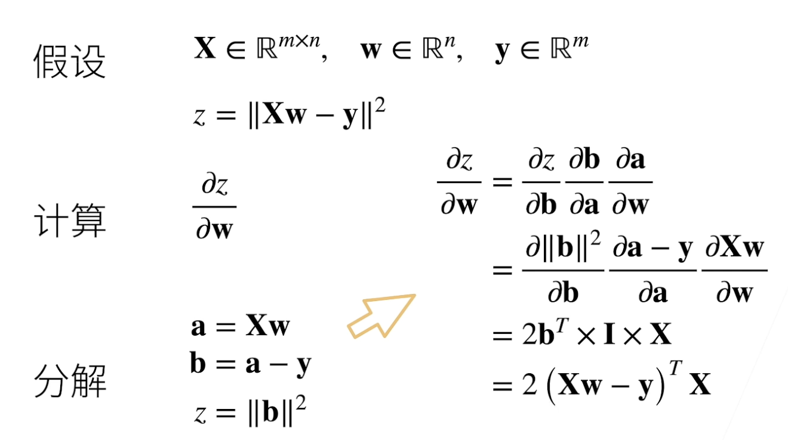

# 动手学深度学习 —— 李沐

> [**课程网站**](https://courses.d2l.ai/zh-v2/)；[**电子教材**](https://zh-v2.d2l.ai/chapter_preface/index.html)；[**教材 Repo**](https://github.com/d2l-ai/d2l-zh)；
>
> 本课程我在 2022 年系统性学习过本课程，后续在科研和实践过程中还是觉得自己的一些理解不够到位，同时对于一些知识也有了新的看法和体会，因此在 2024 年初又开始重新学习，主要为了实现以下三点贡献：
>
> 1. **系统性地梳理框架**，填充自己的学习实践感悟，构建起清晰且扎实地**深度学习脉络**
> 2. 搭建起自己的**深度学习知识库**，方便后续相关内容的收集与整理，本笔记将成为个人的**深度学习基础宝典**
> 3. 书写**清晰完整的笔记内容**，为交流分享提供便利
>
> 学习时沐神告诫我们要始终询问 What, How, Why。自己未来的规划也想在 Why 和 How 上多下文章，因此要始终勤于思考，善于发问，善于总结和延伸！共勉！

## 0～18. Fundation

### 线性代数基础

向量乘法的本质是扭曲空间。

L1 范数和 L2 范数的计算公式分别为：
$$
\Vert x \Vert_1 = \sum_{i = 1}^n\{x_i\} \\
\Vert x \Vert_2 = \sqrt{\sum_{i = 1}^n{x_i^2}}
$$
对于矩阵而言，其 Frobenius Norm 为：
$$
\Vert X \Vert = \sqrt{\sum_{i=0}^n\sum_{j=0}^m{x_{i,j}^2}}
$$

### 矩阵求导

**亚导数**是指对不可导函数的不可导点设定一个固定的值，比如 $y = |x|$ 或 $y = \mathrm{Relu}(x)$ 。

**向量求导**，关键是**搞清楚形状**，正如下面这幅图所示，存在四种情况。在实际应用中，尤其是卷积等操作往往都是更高维度的计算，但一般而言都存在求和或者求平均（Loss 一般是个标量）的操作，所以很少会出现矩阵对矩阵求导出现高维矩阵的情况，在此不赘述矩阵间的求导运算。


我们分别对这四种情况构造一个例子。

- **标量对标量求导**： $y = x^2$，求导可得 $\frac{\mathrm{d}y}{\mathrm{d}x} = 2x$，那么当 $x = 2$ 时导数为 $4$

- **标量对标量求导**：$x$ 是一个列向量，$y$ 是一个标量，导数是一个行向量，一个简单的例子 $y = x_1^2 + x_2^2$，求导可得 $\frac{\mathrm{d}y}{\mathrm{d}x} = \{\frac{\mathrm{d}y}{\mathrm{d}x_1},\frac{\mathrm{d}y}{\mathrm{d}x_2}\}$，从数学形式上或许不好理解其导数的含义，但是从形状上可以得到，**导数和等高线的切线正交向外**，也即数值增长最快的地方。

- **向量对标量求导**：$y$ 是一个列向量 $x$ 是一个标量，导数是一个列向量，一个简单的例子 $y_1 = 2x, y_2 = 3x$，求导可得 $\frac{\mathrm{d}y}{\mathrm{d}x} = \{\frac{\mathrm{d}y_1}{\mathrm{d}x},\frac{\mathrm{d}y_2}{\mathrm{d}x}\}$。

- **向量对向量求导**：得到一个矩阵，其含义是十分清晰简单的，也就是一个列向量 $y$ 的每一个元素对另一个列向量 $x$ 求导得到一个行向量做行。

  

**向量的链式求导法则**是梯度下降的核心所在，本质是对上述四种情况的组合，下面有一个**线性回归的例子**：

- 首先，是只有一个 Sample ，每个 Sample 有 n 维 Feeature 的例子（Loss 是 MSE）

  

- 其次，是有 bs (m) 个 Sample，每个 Sample 仍然有 n 维 Feature 的例子（Loss 是 MSE 求和）

  

**计算图自动求导**，TF 是需要用户显示构造计算图，Pytorch 则不需要是隐式的。自动求导有两种方式，一种是正向累计，一种是反向传播。对于一个有 n 个计算节点的计算图而言，二者相似点在于内存复杂度，都需要**保存计算图中每一个节点的值也即 O(n)**，所以都十分消耗空间；不同点在于，反向求导的计算整张图复杂度为 O(n)，而正向累计计算每一个节点的复杂度都是 O(n)。框架自动求导都选择反向传播的思路，在训练时 `.train()` 由于存在 `forward()` 和 `backward()` 两个操作，所以比较耗时。

因此在构造神经网络 `forward()` 函数的时候，**就是在构造一张计算图**，如果想要将其中的某个值从图中分离出来，就可以用 `.detach()` 来做，来看一个例子：

```python
x = torch.range(0, 3, requires_grad=True)
u = x * x
y = u * x
y.sum().backward()
print(x.grad)
# [0, 3, 12, 27] = 3x^2

x.grad.zero_()

u = x * x
y = u.detach() * x
y.sum().backward()
print(x.grad)
# [0, 1, 4, 9] = x^2
```

### [线性回归](https://zh-v2.d2l.ai/chapter_linear-networks/linear-regression.html)

线性回归是入门深度学习的一个经典例子，线性模型在本质上是一个**单层线性神经网络**，以此为出发点，就可以明白三个问题：1.什么是模型？2.什么是损失函数？3.怎么样优化模型？

**推导显示解**

> 线性模型是最简单的神经网络模型，也是从现在开始所学习的唯一具有显示解的模型，其具有极强的代表意义，但是太过简单。

其实在计量经济学和统计学中，我们推导过单自变量的**二元线性回归**和多自变量的**多元线性回归**的解，这些问题都存在明确且严格的解析解，因为参数较少所以也比较容易推导。对于更加普遍的多元线性回归，我们也可以得到更加统一的解析解，严格推导过程如下：设 $\bold{X} \in \mathbb{R}^{n\times d}$ 表示整个数据集中的 $n$ 个含有 $f$ 个特征的样本，其中 $\bold{X}$ 的每一行代表一个样本，每一列是一种特征。对于特征集合 $\bold{X}$ 预测值 $\hat{\bold{y}}\in \mathbb{R}^n$ 可以通过矩阵-向量乘法表示为：
$$
\hat{\bold{y}} = \bold{Xw} + b
$$
为了简化推导，在此我们只考虑 $\bold{w}\in\mathbb{R}^d$ ，将上式修改为：
$$
\hat{\bold{y}} = \bold{Xw}
$$
选择**损失函数**为 MSE，那么可以得到：
$$
L(\bold{w}) = \frac{1}{n}\sum_{i=1}^n(y_i - \hat{y}_i)^2= \frac{1}{n} ||\bold{y} - \hat{\bold{y}}||^2 = \frac{1}{n}||\bold{y} - \bold{Xw} - b||^2
$$
下面我们的**优化目标**就是找到 $\bold{w}\in\mathbb{R}^d$ 使得 $L(\bold{w})$ 最小，因为线性模型的损失函数是一个凸函数，因此令 $\frac{\mathrm{d}(L)}{\mathrm{d}(\mathrm{\bold{w})}} = 0$ 进而求解 $\bold{w}$ 可以使得损失函数最小，为了简化运算，此处将偏差加入权重，做一个简单的调整：
$$
\bold{X}\leftarrow[\bold{X}, 1], \bold{w}\leftarrow[\bold{w}, b](vertical)
$$
进而令：
$$
\frac{\mathrm{d}(||\bold{y} - \bold{Xw}||^2)}{\mathrm{d}(\mathrm{\bold{w})}} = 0
$$
为了求解导数，我们在此处设：
$$
\bold{a} = \bold{Xw} \\
\bold{b} = \bold{y} - \bold{a}
$$
那么：
$$
\begin{align}
\frac{\mathrm{d}(||\bold{y} - \bold{Xw}||^2)}{\mathrm{d}(\mathrm{\bold{w})}} &= \frac{\mathrm{d}(||\bold{b}||^2)}{d(\bold{w})}
\\ &= \frac{\mathrm{d}(||\bold{b}||^2)}{\mathrm{d}(\bold{b})} \times \frac{\mathrm{d}(\bold{b})}{\mathrm{d}(\bold{a})} \times \frac{\mathrm{d}(\bold{a})}{\mathrm{d}(\bold{w})} 
\\&= 2\bold{b}^T \times \bold{-I} \times \bold{X}
\\&=-2(\bold{Xw} - \bold{y})^T\times\bold{X}
\end{align}
$$
因此令：
$$
-2(\bold{Xw} - \bold{y})^T\times\bold{X} = 0
$$
进而可得解析解为：
$$
\bold{Xw}^T\bold{X} - \bold{y}^T\bold{X} = 0\\
\bold{w}^T\bold{X}^T\bold{X} = \bold{y}^T\bold{X}\\
\bold{w}^*{^T} = \bold{y}^T\bold{X}(\bold{X}^T\bold{X})^{-1} \\
\bold{w}^* = (\bold{X}^T\bold{X})^{-1}\bold{X}^T\bold{y}
$$
**随机梯度下降算法**

算法在实际上只能采用小批量随机梯度下降，核心只有两步，随机的含义是每次采样都是随机抽取：

- 初始化模型参数的值，如随机初始化；
- 从数据集中**随机抽取**小批量样本且在负梯度的方向上更新参数，并不断迭代这一步骤。 

在实际应用中需要注意：

- 因为一次性载入数据集中的所有数据不现实（内存爆炸），所以需要随机抽取小批量数据计算批量 loss 近似表示整体 loss；
- 批量大小和学习率之间需要相互协调，一般来说 batch size 扩大几倍，lr 就该扩大几倍。

**实现线性回归**

详情见代码 `/00_to_18_Fundation/linear_regression(_scrach).py`

### 关于超参的常问细节：

- 几个超参：`lr`、`bs`、`the reduction of MSE Loss` 的设置和梯度更新函数是紧密相关的，如果我们将 `reduction` 设置为 `mean` 那么 `lr` 自然应该调大一些。 [**[Definition.]**](https://zhuanlan.zhihu.com/p/277487038)  [**[Detail.]**](https://zhuanlan.zhihu.com/p/83626029)
- `Epoch` 设置多少一般是人为决定，可以用一些 `Early Stop` 的方式判断是否收敛
- 模型参数初始化也有一定的方式，以下是一些参考：
  - [**Default Ways**](https://blog.csdn.net/luo3300612/article/details/97675312)
  - [**Some Initializing Ways**](https://www.cnblogs.com/jfdwd/p/11269622.html)
  - [**Why CAN'T be all ZERO ?**](https://www.cnblogs.com/hejunlin1992/p/13022391.html)
  - [**How to Init the Parameter ?**](https://blog.csdn.net/PanYHHH/article/details/107338657)
- What is the relationship between `model.eval()` and `torch.no_grad()`. [**Ref.**](https://blog.csdn.net/qq_41813454/article/details/135129279)

### [SoftMax 回归](https://zh-v2.d2l.ai/chapter_linear-networks/softmax-regression.html)

aa


## 68.Transformer

> [**Ref 1. Note in Zhihu**](https://zhuanlan.zhihu.com/p/338817680)
>
> **[Ref 2. Video](https://www.bilibili.com/video/BV1Kq4y1H7FL/?spm_id_from=333.999.0.0)**
>
> **[Ref 3. Paper Reading](https://www.bilibili.com/video/BV1pu411o7BE/?spm_id_from=333.999.0.0)**
>
> **[Ref 4. Book](https://zh-v2.d2l.ai/chapter_attention-mechanisms/transformer.html)**

### Paper Reading

#### Motivation

目标是使用**纯 Attention 架构**解决 Seq2Seq 的问题，核心思想是**如何尽可能地识别和提取时序信息**，落脚点是一个机器翻译任务。Fancy 的点在于**简单 + 并行计算 + 最大路径长度**，打其他的网络的点：

- RNN 时间上无法并行并且历史信息一步步向后传递，可能会有损失，如果想要保留尽可能多的信息就要扩大隐藏层，但这会带来空间消耗。

  > Transformer 对每个时序特征的提取和 RNN 一样是线性操作，但只不过将对时序信息的提取从之前按时间顺序从前往后的堆叠修改成了全局的 Attention。

- 卷积操作的注意力是有限的，需要很多层一点点提取才可以关注到整张图所有 Pixel 之间的信息，但是 Attention 的可以直接关注到整张图的信息。

  > 卷积操作可以拓展 Channel 维度，进而实现不同的 Channel 上能表征出不同的特征。参考这种多输出通道的效果，Transformer 引入**多头注意力机制（Multi-Head Attention）**表征不同的 Attention 信息。

#### Model Architecture

> 整体上是 Encoder-Decoder 架构


**Encoder**

总共有 **6** 层堆叠块，每个块结构相同都有两个 sub-layers，对每个 sub-layer 都用到了 residual connection 和 layer normalization（为了保证残差连接的简单性，每一层的特征维度设为固定值 **512**）

> 可以看到在 Encoder 中就只有两个超参数：堆叠块的个数；每一层的特征维度。因此在后续的 Bert 和 GPT 等应用中，核心关注的就是这两个超参数的设定。

- The first is a **multi-head self-attention mechanism**.
- The second is a simple, position- wise fully connected feed-forward network **(MLP).** 

因此，总的来说 Encoder 每一层所做的运算为：

```python
x = LayerNorm(x + MultiHeadAttention(x))
x = LayerNorm(x + MLP(x))
```

其中，LayerNorm 操作是极为关键的，也正是因为 Transformer，LN 才进入了大众的视野，在语言任务中被更多人熟知并使用。

> **Why LayerNorm ?** [Ref.](https://zhuanlan.zhihu.com/p/492803886)
>
> 我们再回顾一下 BatchNorm（特征维度的标准化）和 LayerNorm（样本维度的标准化）的计算方式定义
>
> ```python
> x.shape=(bs, f) # 表示有 f 个 feature
> # ------ BN ------ #
> bn = BN(f) 
> x = bn(x)
> 是对 batch 中所有样本的每一个特征标识维度上做 norm, 因此:
>   	- mean.shape=(1, f)
>     - std.shape= (1, f)
> 可以看到 BN 是对整个 batch 上对特征维度的标准化, 其所依赖的一个核心假设是在一个 batch 中的每一个 case 在同一特征上的特征服从同一分布。
> # ------ LN ------ #
> LN = LN(f)
> x = ln(x)
> 是对 batch 中的每一个样本分别做 norm, 可以自定义 norm 的 shape, 如上例
> 	- mean.shape=(bs, 1)
>   - std.shape=(bs, 1)
> 可以看到 LN 是对 batch 中每一个元素特征的标准化, 当 batch 中的每一个 case 的特征分布并不相同时 (也就是说不同的 case 情况各不一致) 往往选择在每一个 case 内部进行标准化。
> ```
>
> 为了更贴近于实际的使用情况，再给一个三维的情况
>
> ```python
> x.shape = (bs, seq, f) # 时间长度为 seq, 共有 f 个特征
> # ------ BN ------ #
> bn=BN(f)
> 	- mean.shape=(1, 1, f)
> 	- std.shape=(1, 1, f)
> # ------ BN ------ #
> ln=LN(seq, f)
> 	- mean.shape=(bs, 1, 1)
> 	- std.shape=(bs, 1, 1)
> ```
>
> 对应的示意图如下：
>
> 
>
> 在语言任务中，每个输入的 case 都是切好的一个个句子，但是句子的长度可能不一致（一句话可能有 5 个词，一句话可能有 4 个），且模型对 seq 的要求是固定的。因此在构建数据集时为了保持输入的形状相同（seq 相同）就需要进行截断或者补全。
>
> ```python
> 对于一句有 4 个词的话, 其 one-hot 编码后 shape 为 (4, word_size) 其中 word_size 是词的总样数。对于一句有 5 个词的话其 shape 为 (5, word_size)。此时模型设定的 seq = 5, 那么就需要对第一句话填 0, 使之形状为 （5, word_size）
> ```
> 
>由于句子长度不同而产生了截断或补全进而导致了在 batch 维度上计算均值方差是没有意义的。李沐老师举了一个例子，如果在模型训练的时候遇到的都是截断的比较短的句子，求的均值方差是针对短句的，那么在推理时如果遇到长句子就没有效果了。如果一句话中每一个词的语意特征分布相同的话，在每一句话的 seq 和 f 维度上进行 Norm 或许是更加正确的选择，也就是进行 LN。
> 
>总的来说，由于语言任务中每句话的长短可能不一致，由于强行截断或补充导致了数据分布不在统一，因此针对每个 case 的 LN 比针对每个feature 的 BN 可能表现更佳。

**Decoder**

同样是 **6** 个堆叠块，但是有三个 sub-layers ，其中后两个的结构和 encoder 完全相同，但是第一层在多头注意力机制上采用的是带掩码的多头注意力机制以保证不会看到后面的信息（翻译的过程是逐步进行的）。

**Attention**

An attention function can be described as **mapping a query and a set of key-value pairs to an output**, where the query, keys, values, and output are all vectors. The output is computed as a weighted sum of the values, where the weight assigned to each value is computed by a compatibility function of the query with the corresponding key.

> ```python
> 在这里先举一个简单的只有 1 个特征的情况
> A key-value pairs: k.shape = v.shape = (10,1) 表示 10 个 seq, 1 个特征
> # ----- Simple Case ----- #
> q.shape = (1,1) 也就是说 q 中只有一个值
> # step 1.
> 让 q 和 k^T 中的每一个元素算 distance 得到一个 shape=(1,10) 的权重矩阵向量
> # step 2.
> 然后让该权重向量与 v 相乘 (1,10) x (10,1) 得到输出 (1)
> # ----- Self Attention ---- #
> 如果 q = k = v
> # step 1.
> 让 q 和 k^T 计算 distance 得到一个 shape=(10,10) 的权重矩阵，第 i 行表示 k 向量与 q[i] 计算出来的权重向量。
> # step 2.
> 让该权重矩阵与 v 向量相乘, (10,10) x (10,1) 得到 对 v 的加权输出 (10, 1) 
> ```

- Scaled Dot-Product Attention 

  常见的计算注意力机制的方式有两种：一种是 **additive attention**，其可以处理特征维度不同的情况，另一种是 **dot-product (multi-plicative) attention**，这个地方使用的的就是乘性注意力机制，但多加了一个 scale （除以 $\sqrt{d_k}$）作者解释这种用法的好处在于 softmax 时不要让其中的一些权重过于趋近于 1 或 0 。总的来说计算公式为：
  $$
  Attention(Q, K, V) = \mathrm{softmax}(\frac{QK^T}{\sqrt{d_k}})V
  $$
  计算的示意图如下，注意**其中的 Mask 是在 Decoder 时加入**的，防止看到当下时间点后续的 K 时所加入的一个掩码（解码器对序列中一个元素输出时，不应该考虑该元素及其之后的元素内容，因为在 pridict 的时候是拿不到的）。矩阵乘法 + Scale 完成后，只把能看到 K 对应的结果取出来计算对应权重，其他的看不到的权重设为 0。

  具体过程如下图所示：

  

  > 为了便于理解，在此给出一个 **self-attention** 的例子，也即 Q, K, V 的形状都相同。需要注意的是按照这种乘性注意力机制，计算 attention 分数必须保证 Q 和 K 的特征维度是一样的，但是 K 的特征维度可能与 Q, K 不等。
  >
  > ```python
  > Q = K = V, shape = (4, 3), 也即 4 个 seq, 3 个特征
  > ```
  >
  > 

- Multi-Head Attention

  始终要记住 Attention 的本质是对时序维度信息的抓取（求权重）以及汇聚（加权和）。因此一切关于 Attention 的设计都是为了提高特征抓取能力。此处设计官方解释的好处如下（从两个方面**提高了特征提取能力**）：

  - Multi-head attention allows the model to jointly attend to information from different representation subspaces at different positions. With a single attention head, averaging inhibits this. 用人话来讲就是模拟多 Channel **提取更多维度**的表征信息。
  - 由于乘性注意力没有特别多可以学习的参数，拓展多头注意力机制的做法是对输入的 Q,K,V 做**可学习的多头线性投影，而不是粗暴的切分（但在代码实现的时候，为了不使用循环，一般先用一个大的 $W$ 实现 $d_{model} \to d_{model}$ 的投影，然后再切分）**，然后分别进行注意力学习。不同的头的映射参数不同，增加了特征提取能力。**这一部分的代码底层需要仔细体会。**

  总的来说计算的公式为：

  

  计算的示意图如下：

  

- Attention in Transformer

  从框架图中就可以看出 Transformer 中用到的全部都是**自注意力机制**，如果不考虑多头的话，其每次注意力的本质就是顺次时间步的特征做 Q 和 t 个时间步下的 K 做 Attention 得到 t 个权重（自己对自己的 Attention 肯定是最高的），然后与对应时间步的 V 进行加权求和得到该 Q 权重下的输出（这一段很绕，但是很容易理解，抓住 Q 是产生权重的关键，有多少个 Q 就有多少组权重，Q 的数量和最终输出的数量是相同的就可以了）。代码实现可以用 for-loop 来做，但是为了并行就需要设计成矩阵乘法，上面的图中展示了可视化运行过程。

  总的来说 Transformer 中有**三种 Multi-Head Attention**，因为特征的**形状基本保持一致**，所以很容易进行搭建。

  - 在 Encoder 中就是最基础的
  - 在 Decoder 的第一层是针对目标语言的 Attention，因为看不到后面的 K 所以需要加入 Mask 
  - 在 Decoder 的第二层使用 Encoder 的结果最为 K-V 对，Decoder 的特征作为 Q

**Feed Forward**


本质上来说就是两层（含有一个隐藏层）的 MLP

```python
x = (bs, seq, 512)
fc = nn.Sequential(nn.Linear(512, 2048),
                   nn.Relu(),
                   nn.Linera(2048,512))
```

为什么 MLP 不需要再对时间步进行特征提取？就像上面说的那样，我们认为 Attention 的主要作用是提取时序信息，MLP 在此更重要的是对特征维度信息进行提取。

**Embedding**

Embedding 本质是线性转换，目的是将稀疏的词信息（可能是 one-hot 得到的）转化为长度相同的特征向量，提高了信息密度和特征表示能力。Embedding 的到的结果还乘了一个 scale $\sqrt{d_{model}}$ 这是因为如果 Embedding 后的特征空间维度很大的话，得到的特征信息可十分小（接近于 0 ）而后续加 PE 的时候是一个确定值，因此如果不做 scale 会导致后面 PE 出来的信息占据主导了，词本身的信息被掩盖了，**本末倒置**。

**Positional Encoding**

还记得 Transformer 的初心是提取时序信息，尽管现在能够扫描的时序视野理论上已经可以拓展到无限长，也就意味着任意时点的关系都可以被提取到。但是时序信息中的先后关系也是十分重要的特征，然而之前没有一个地方提取了**先后时序关系**。说白了 Attention 的过程完全没有 Care 任何先后的概念，就算把输入的句子顺序彻底打乱，输入变得完全不一样，但是输出的结果却不会有任何改变。

Since our model **contains no recurrence and no convolution**, in order for the model to make use of the order of the sequence, we **must inject some information about the relative or absolute position of the tokens** in the sequence.

为了表征输入的先后时序信息，引入了 PE，具体而言是对每一个时间步都构建一个长度为 512 的特征向量（任何两个时间步上该向量都不会重复！就像身份信息一样**唯一标识了此时间步的位置**），本文作者使用的 SIne-Cosine 函数。每一个点的具体值由其所在向量的 positon 以及其在该向量中的 index （影响周期）共同决定。


#### Why Self-Attention ?

感受野更好了，处理长序列数据的能力更强了。但是从理论上来看，其优势在于对数据的假设更加宽松了，抓取信息的能力差了，因此如果有较多的数据就可以 Train 出来一个比较好的模型。

#### Experiment

标签使用了 [**Label Smoothing**](https://zhuanlan.zhihu.com/p/477813062) 的 Trick

可以调的超参数只有三个

- Multi-Head Attention 层的数量 $N$，头的数量 $h$
- 特征宽度 $d_{model}$

其他的一些超参可以随着这几个参数的变化而变化。

### Code

一个模块一个模块地从零开始实现，放在了代码中。实现方法和论文基本没有差别。在实际用的时候直接套用 torch.nn 中写好的模块。
