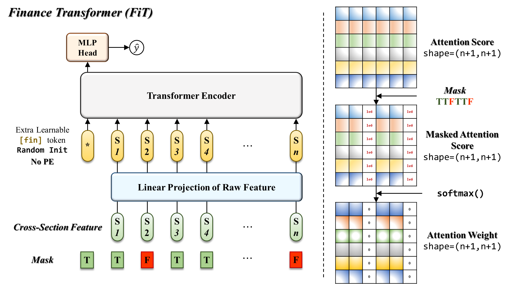

# Networks


## Finance Transformer (FiT)

> A new **Plug-and-Play module** for **Finance Cross-Section Feature** Extraction.

### What is Cross-Section Feature ?

Cross-Section feature refers to the observed values of the **same feature of a group of samples** reflecting an aggregate **at the same time cross-section and is one of the common types of sample data.

Cross-section data are generally characterized by the following:
- It is characterized at one point in time, with **no temporal information**.
- The order of the samples on the cross-section is changeable, i.e., the **sample order contains no information**.
- Some samples **may not contain information**.


### Why we need FiT ?

Since the cross-section data has several features as described above, we want to have an information extraction module that satisfies the following properties:
- The extracted information of the module is **not affected by the order of the samples**.
- Samples without information **can be ignored**.

These two properties are at the heart of why Finance Transformer was proposed !

### What is the FiT ?

The **framework** of FiT is shown below.



FiT achieves the top 2 goals through a **two-part design**, respectively:
- Similar to the ViT architecture, the `[fin]` token is introduced to **summarize information**. However, since there is **no positional encoding**, it can be realized that the **output is independent of the order of the inputs**.
- Perform **Attention with Mask** to ignore the parts that do not contain information.


A **demo** using FiT:


### How to use FiT ?

```python
# random the input
features = torch.randn(64, 5, 768, dtype=torch.float32)
masks = torch.randint(low=0, high=2, size=(64, 5), dtype=torch.long)

# init the model
fit = FiT(
    input_size=768,
    dim=64,
    depth=1,
    heads=2,
    ff_hidden_dim=32
)

# forward
output = fit(features, masks)
print(output)
```

